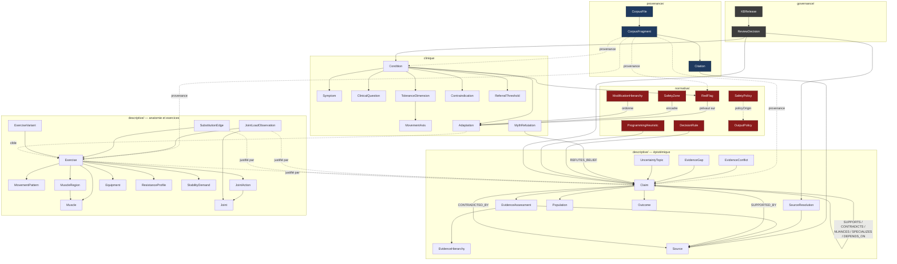

# Knowledge Base FitTrack — Architecture proposée

**Phase 1 : conception. Aucune implémentation d'extracteur.**
Corpus analysé : 4 fichiers, 238 304 octets, arrêtés au 23 août 2026.

**Convention de lecture.** Trois marqueurs sont utilisés dans tout ce document :

| Marqueur | Sens |
|---|---|
| **[C]** | Fait présent dans le corpus, vérifiable par citation de fragment. |
| **[DM]** | Décision de modélisation. Ne provient pas du corpus. Discutable et révisable. |
| **[?]** | Information manquante, ambiguë ou non résolue dans le corpus. Ne doit pas être comblée. |

---

## 1. Cartographie synthétique des quatre fichiers

### 1.1 Vue d'ensemble

| # | Fichier | Taille | Nature | Granularité dominante | Rôle dans la KB |
|---|---|---|---|---|---|
| F1 | `Programmation hypertrophie — État des connaissances.md` | 71 455 o / 300 l. | Rapport scientifique tabulaire | **Ligne de tableau = 1 claim** | Source primaire de `Claim` sur les variables de programmation |
| F2 | `Anatomie, biomécanique et sélection d'exercices.md` | 96 689 o / 413 l. | Rapport scientifique en prose dense | **Paragraphe = 1 à 4 claims imbriqués** | Source primaire d'`Exercise`, `Muscle`, `JointAction`, `SubstitutionEdge` |
| F3 | `Base de connaissances — coaching musculation adaptatif.md` | 47 236 o / 302 l. | Rapport clinique mixte prose/tableaux | **Tableau régional = 1 fiche de condition** | Source primaire de `Condition`, `RedFlag`, `Adaptation`, `SafetyZone` |
| F4 | `Schéma de données IA coaching.json` | 8 638 o | JSON Schema draft 2020-12 | **`$defs` = 7 types** | Modèle existant à auditer et migrer, non à copier |

### 1.2 F1 — Programmation hypertrophie

**Structure.** Résumé exécutif → §1 méthode et langage de certitude → §2–16 un chapitre par variable d'entraînement → §17 populations → §18 contradictions → §19 schéma décisionnel IA → §20 métadonnées de publications → §21 règles fortes → §22 principes conditionnels → §23 zones d'incertitude → règle de prudence de clôture.

**Le point structurant : un tableau canonique à 9 colonnes** répété identiquement de §2 à §16. C'est le gabarit de claim le plus abouti du corpus.

| Colonne du corpus | Champ cible dans la KB |
|---|---|
| Affirmation principale | `Claim.canonicalStatement` |
| Confiance | `EvidenceAssessment.confidence` (parfois **double**, cf. §3.2) |
| Population | `Claim.populationRef` + `Population.rawDescription` |
| Sources principales | `Claim.supportingSourceIds` |
| Type de preuve | `EvidenceAssessment.evidenceTypes[]` |
| Contradictions / nuances | `Claim.contradictingSourceIds` + amorce d'`EvidenceConflict` |
| Limites | `Claim.limitations[]` |
| Interprétation pratique | `Claim.practicalInterpretation` |
| Ce qu'on ne peut PAS conclure | `Claim.cannotConclude[]` |

**Inventaire.**

- 142 lignes de tableau, dont ~58 lignes de claims à 9 colonnes réparties sur 15 chapitres.
- 139 liens externes, 32 DOI distincts, 11 PMID.
- §20 : **table de métadonnées vérifiables** de 26 publications (titre, auteurs, année, journal, type, DOI, PMID, URL) — le seul registre de sources structuré du corpus avec F3 §15.
- §1.1 : hiérarchie de preuves à 8 rangs, sommet = *position stands*.
- §1.2 : échelle de confiance à 4 niveaux (Élevé / Modéré / Faible / Très faible).
- §1.4 : **cartographie épistémique à 5 statuts** (Solidement établi, Probable mais incertain, Controversé, Surtout mécanistique, Surtout pratique) avec traitement IA prescrit par statut.
- §18 : 7 désaccords formalisés (Désaccord | Résultat dominant | Résultat contraire | Explication probable).
- §21 : 14 règles fortes. §22 : 10 principes conditionnels. §23 : 17 zones d'incertitude.
- Clôture : lexique interdit (`optimal`, `nécessaire`, `inutile`, `maximal récupérable`).

**Champs implicites, jamais structurés.** Population (prose : « 79 % hommes », « 39 jeunes entraînés, 29 hommes/10 femmes »), outcome mesuré (IRM vs DXA vs circonférence, discuté en §1.3 mais jamais encodé par claim), durée d'intervention, taille d'échantillon, intervention/comparateur.

### 1.3 F2 — Anatomie, biomécanique, sélection d'exercices

**Structure.** §0 méthode → §1 anatomie fonctionnelle (14 groupes musculaires) → §2 profils de résistance (6 modalités) → §3 longueur musculaire → §4 ROM → §5 stabilité → §6 contraintes articulaires (7 articulations) → §7 familles d'exercices (9 familles) → §8 substitutions → §9 retour empirique → §10 **schéma de données exercices proposé** → §11 contradictions et lacunes → §12 règles de prudence d'encodage.

**Inventaire.**

- 102 liens externes, 25 DOI — mais **presque tous enfouis dans des URL d'éditeur** (`linkinghub.elsevier.com/retrieve/pii/…`, `thieme-connect.de/DOI/DOI?…`, `ovid.com/10.1519/…`, `mdpi.com/…`), 0 PMID explicite.
- 49 lignes de tableau seulement : §0.2, §0.3, §8.3, §10, §11. **Le contenu scientifique est en prose**, pas en tableau.
- §0.1 : hiérarchie de preuves à 7 rangs, sommet = études longitudinales d'hypertrophie mesurée. **Différente de F1.**
- §0.1 : *règle non négociable* — une différence d'amplitude EMG n'est jamais une preuve d'hypertrophie supérieure. Étayée par le cas de référence hip thrust/squat (Plotkin 2023 : EMG 69,5 % vs 29,4 % MVC, hypertrophie IRM équivalente à 9 semaines).
- §6 : **taxonomie à 4 catégories obligatoire** pour toute contrainte articulaire — `charge_mecanique`, `inconfort_rapporte`, `risque_demontre`, `risque_suppose`.
- §8.2 : trois niveaux d'équivalence de substitution (quasi directe / acceptable / partiellement équivalente).
- §8.3 : 8 critères de substitution avec « question à poser » et « conséquence si différent ».
- §10 : 17 champs de fiche exercice, chacun assorti d'un **statut épistémique** et d'une remarque.
- §11 : 5 contradictions + un paragraphe de **lacunes explicitement à ne pas combler**.
- §12 : 6 règles de prudence d'encodage, directement traduisibles en tests automatiques.

**Ce que F2 ne contient pas.** Aucun registre de sources structuré. Aucune fiche d'exercice instanciée — §7 le dit explicitement : le format complet « sera renseigné progressivement pour plusieurs centaines d'exercices dans une base de données séparée ». **`Exercise` est donc un schéma sans instances dans le corpus. [?]**

### 1.4 F3 — Base de connaissances clinique

**Structure.** Finalité et limite → §1 résumé opérationnel (6 principes) → §2 cadre de décision (informations minimales, 3 zones, hiérarchie de modification à 7 niveaux) → §3 red flags → §4 douleur/irritabilité et algorithme → §5 tendinopathies → §6 rachis → §7 épaule → §8 coude/poignet → §9 genou → §10 retour à l'entraînement → §11 mythes → §12 règles conversationnelles → §13 matrice par problème → §14 niveaux de preuve → §15 registre des sources → §16 limites et gouvernance → §17 renvoi à F4.

**Inventaire.**

- 97 lignes de tableau, 86 liens, 18 DOI, 6 PMID.
- §15 : registre de 23 sources prioritaires (organisme, titre, année, type, DOI/PMID, population et usage). Densité de métadonnées supérieure à F2, inférieure à F1 §20.
- §13 : **matrice à 10 colonnes sur 15 conditions** — c'est la projection tabulaire directe de `conditionRecord` de F4. Point de jointure F3↔F4 le plus net.
- §3 : 8 lignes de red flags (Signal | Action minimale | Fondement).
- §2.2 : 3 zones avec, pour chacune, un profil, une liste `allowedActions` et une liste `forbiddenActions`.
- §11 : 12 mythes réfutés, avec niveau de confiance **sur la réfutation** — objet épistémique distinct d'un claim positif.
- §12 : 7 formulations interdites textuelles + 1 formulation recommandée.
- §14 : échelle A/B/C/D + `expert_practice`. **Cinquième valeur qui n'est pas un niveau mais un type de connaissance.**
- §16 : signale que SAPS 2014, NASS 2014 et Cochrane 2015 sont **anciennes**, que poignet/épitrochléalgie/biceps/triceps manquent de CPG directes, et exige une révision annuelle avec conservation des identifiants de sources et date de revue par règle.

**Le conflit de seuil, explicitement documenté (§4.2).** « 0–3/10 » est une politique produit conservatrice ; le seul modèle publié documenté ici est ≤5/10 (Sprague 2021, 15 sujets, tendon patellaire). Le corpus impose de nommer le premier **politique de sécurité** et non vérité médicale. Cela oblige à une entité distincte de `Claim`.

### 1.5 F4 — Schéma de données IA coaching

**Structure.** JSON Schema 2020-12. Racine : `schemaVersion` (const 1.0.0), `lastEvidenceReview`, `globalSafetyRules` {`disclaimer`, `redFlags[]`, `zoneLogic`{green, orange, red}}, `conditionRecords[]`.

**`$defs` (7) :** `source`, `evidenceRating`, `redFlag`, `zoneRule`, `toleranceDimension`, `modification`, `conditionRecord`.

**Vocabulaires contrôlés déjà présents — actif à préserver.**

| Enum | Valeurs | Verdict d'audit |
|---|---|---|
| `source.documentType` | 9 valeurs | À conserver, à **étendre** (pas de `emg_study`, `anatomical_study`, `narrative_review`, `qualitative_survey`, `animal_model`) |
| `evidenceRating.level` | `A_high`…`D_very_low`, `expert_practice` | À **scinder** : mélange grade et type de connaissance |
| `evidenceRating.confidence` | high / moderate / low / very_low | À conserver, mappe F1 §1.2 et F2 §0.2 |
| `evidenceRating.directness` | direct_clinical, indirect_clinical, biomechanical_only, expert_only | À **étendre** : ne couvre ni l'EMG, ni l'anatomie cadavérique, ni les modèles animaux, ni l'hypertrophie mesurée |
| `redFlag.action` / `urgency` | 3 / 4 valeurs | À conserver tel quel |
| `toleranceDimension.status` | 6 valeurs dont `unknown`, `not_tested` | À conserver — distinction absence/négatif déjà correcte |
| `toleranceDimension.basis` | 5 valeurs | À conserver |
| `conditionRecord.scope` | symptom_pattern, known_diagnosis, postoperative_state, general_principle | À conserver |
| `diagnosticCertaintyRequired` | 4 valeurs | À conserver |
| `irritability` | unknown / low / moderate / high | À conserver |
| `contraindication.scope` | absolute_until_assessed, temporary, clinician_order_only | À conserver |

**Défauts structurels identifiés — 11 points.**

1. **Double régime de référence aux sources.** `conditionRecord.sources` embarque des objets `source` complets, alors que `redFlag`, `evidenceRating` et `contraindication` référencent des `sourceIds`. Les identifiants pointent vers un registre qui n'existe pas au niveau racine. Duplication garantie et intégrité référentielle non vérifiable.
2. **Aucun identifiant** sur `conditionRecord`, `modification`, `zoneRule`. Diff Git illisible, révision humaine non ciblable, IDs non stables entre versions.
3. **`movementSensitivity` en `additionalProperties` libre** : aucun vocabulaire contrôlé d'axes de mouvement, donc aucune jointure possible avec F2.
4. **Redondance avec les champs nommés** `axialLoadTolerance`, `flexionTolerance`, `extensionTolerance`, `rotationTolerance`, `overheadTolerance` : le même axe peut être encodé deux fois, à deux endroits, avec deux valeurs.
5. **`level` conflate grade de preuve et type de connaissance** (`expert_practice` n'est pas un niveau de A à D).
6. **Aucune provenance textuelle.** Rien ne relie une règle au fragment de F3 qui la porte.
7. **Aucune représentation des contradictions ni des lacunes.** F1 §18, F2 §11 et F3 §11 n'ont aucune cible.
8. **`uncertainty` est un tableau de chaînes libres** — non exploitable, non testable.
9. **`lastEvidenceReview` est global.** F3 §16 exige une date de revue **par règle**.
10. **Aucune entité `Exercise`.** F3 nomme pourtant des dizaines d'exercices en texte libre (belt squat, chest-supported row, landmine press, floor press, high-incline press…) sans cible structurée. Rupture F2↔F3↔F4.
11. **`source.url` est `required`.** Une source sans URL stable devient inencodable ; F3 §15 contient déjà des lignes sans DOI. Contrainte trop forte pour un corpus réel.

### 1.6 Matrice de provenance des types d'information

| Type d'information | F1 | F2 | F3 | F4 | Source retenue |
|---|---|---|---|---|---|
| Hiérarchie de preuves | §1.1 (8 rangs) | §0.1 (7 rangs) | §14 (A–D) | `evidenceRating` | **Les trois, nommées séparément** |
| Niveaux de confiance | §1.2 | §0.2 | §14 | `confidence` enum | F4 (enum) + libellés F1/F2 |
| Statut épistémique | §1.4 (5 statuts) | §0.3 (5 types) | §14 | — | F1 §1.4 pour le statut, F2 §0.3 pour le type de preuve |
| Claims de programmation | **§2–16 (58)** | — | — | — | F1 |
| Anatomie fonctionnelle | — | **§1 (14 groupes)** | — | — | F2 |
| Actions articulaires | — | **§1, §10** | — | — | F2 |
| Biarticularité | — | **§1, §3.3** | — | — | F2 |
| Profils de résistance | — | **§2, §10** | — | — | F2 |
| Longueur musculaire / ROM | §7 | **§3, §4** | — | — | Les deux, chevauchement à dédupliquer |
| Stabilité | §9 | **§5, §10** | — | — | F2 pour le classement, F1 pour l'effet |
| Contraintes articulaires | — | **§6 (4 catégories)** | §6–9 (clinique) | — | F2 pour la charge mécanique, F3 pour la tolérance individuelle |
| Familles d'exercices | — | **§7** | §6.3, §7–9 | — | F2 |
| Critères de substitution | §9 | **§8.2, §8.3** | §6.3, §7–9 | — | F2 pour les critères, F3 pour les substitutions cliniques |
| Schéma exercice | — | **§10 (17 champs)** | — | — | F2 |
| Conditions cliniques | — | — | **§6–9, §13 (15)** | `conditionRecord` | F3 pour le contenu, F4 pour la forme |
| Red flags | — | — | **§3 (8)** | `redFlag` | F3 + F4 |
| Zones GREEN/ORANGE/RED | — | — | **§2.2** | `zoneLogic` | F3 + F4 |
| Dimensions de tolérance | — | — | §4, §6–9 | **`toleranceDimension`** | F4 |
| Adaptations / modifications | §11, §19 | §8 | **§2.3, §6–9** | `modification` | F3 + F4 |
| Contre-indications | — | — | §3 | **`contraindication`** | F4, alimenté par F3 §3 |
| Seuils d'orientation | — | — | **§3, §13** | `referralThreshold` | F3 |
| Contradictions | **§18 (7)** | **§11 (5)** | §11 (12 mythes) | — | Les trois, formats à unifier |
| Lacunes de preuve | §23 (17) | **§11** | §16 | — | F1 + F2 + F3 |
| Métadonnées de sources | **§20 (26)** | ✗ dispersées | **§15 (23)** | `source` | F1 + F3 ; **F2 est la lacune** |
| Règles de sortie / lexique | clôture | §12 | **§12** | ✗ | F1 + F2 + F3, **sans cible F4** |
| Politiques de sécurité produit | — | — | **§4.2** | ✗ | F3, **sans cible F4** |

---

## 2. Chevauchements, conflits et lacunes

### 2.1 Conflits de vocabulaire — à résoudre avant toute extraction

**C-1. Trois échelles de certitude incompatibles.**
F1 et F2 : 4 niveaux qualitatifs français. F3/F4 : 5 valeurs dont une (`expert_practice`) qui n'est pas un niveau.
**[DM] Résolution : décomposer en quatre axes orthogonaux**, jamais en un score unique.

| Axe | Domaine | Origine |
|---|---|---|
| `knowledgeType` | EVIDENCE, EXPERT_PRACTICE, HYPOTHESIS, DEFINITION, POLICY, MYTH_REFUTATION | [DM], dérivé de F1 §1.4 et F2 §0.3 |
| `evidenceGrade` | A_high, B_moderate, C_low, D_very_low, not_applicable | F4 `level` moins `expert_practice` |
| `confidence` | high, moderate, low, very_low | F4, aligné F1 §1.2 et F2 §0.2 |
| `directness` | enum étendu (cf. C-3) | F4 étendu |

`expert_practice` cesse d'être un niveau et devient `knowledgeType: EXPERT_PRACTICE` + `evidenceGrade: not_applicable`. Cela satisfait la contrainte non négociable « `EXPERT_PRACTICE` et `HYPOTHESIS` ne doivent jamais être présentés comme des faits établis » **par construction du schéma**, pas par convention d'usage.

**C-2. Deux hiérarchies de preuves divergentes.**
F1 place les *position stands* au sommet ; F2 place les études longitudinales d'hypertrophie mesurée au sommet et relègue l'EMG au rang 6. Ce n'est **pas une contradiction scientifique** mais une différence de finalité : F1 raisonne recommandation, F2 raisonne mécanisme.
**[DM] Résolution : ne pas fusionner.** Créer une entité `EvidenceHierarchy` avec trois instances déclarées — `programming_v1` (F1 §1.1), `biomechanics_v1` (F2 §0.1), `clinical_v1` (F3 §14) — et faire porter à chaque `EvidenceAssessment` un champ `hierarchyRef`. Un rang n'est jamais absolu : il est relatif à la hiérarchie déclarée. Toute fusion aurait détruit une information réelle du corpus.

**C-3. `directness` de F4 ne couvre pas les besoins de F2.**
Enum actuel : `direct_clinical`, `indirect_clinical`, `biomechanical_only`, `expert_only`. F2 a besoin de distinguer au minimum : hypertrophie mesurée, biomécanique/moment arms, EMG, anatomie cadavérique, modèle animal, imagerie/élastographie, enquête qualitative.
**[DM] Extension proposée** — valeurs F4 conservées telles quelles, ajouts en fin :
`direct_clinical`, `indirect_clinical`, `biomechanical_only`, `expert_only`, `direct_hypertrophy_measured`, `emg_only`, `anatomical_cadaveric`, `animal_model`, `imaging_descriptive`, `qualitative_survey`, `mechanistic_hypothesis`.
Justification corpus : F2 §0.3 définit explicitement cinq types de preuve avec ce qu'ils permettent et ne permettent pas de conclure ; F2 §12.1 interdit de fusionner EMG et hypertrophie dans un même champ.

**C-4. Confiance double dans F1.**
Plusieurs lignes portent une confiance composite : « Élevé pour la direction; modéré pour la forme de la courbe », « Modéré pour la distribution; faible pour un plafond chiffré », « Élevé pour l'aigu; modéré pour impact chronique ».
**[DM] Résolution :** `EvidenceAssessment.confidence` devient un tableau d'objets `{aspect, confidence}` plutôt qu'un scalaire. Un aplatissement au niveau le plus bas perdrait de l'information ; un aplatissement au plus haut violerait la contrainte anti-inflation de certitude.

**C-5. Vocabulaire d'exercices non contrôlé et non aligné.**
F3 cite en texte libre : belt squat, split squat, presse, chest-supported row, landmine press, high-incline press, floor press, machine convergente, Swiss bar, poignées de pompes, sangles, box squat, trap-bar, rack pull, kettlebell élevé, sit-to-stand, calf raises gradués.
F2 nomme : développé couché plat/incliné/décliné, dips, pec deck, cable fly, straight-arm pulldown, pull-over, lat pulldown front/back, rowing barre/haltère/poulie/poitrine appuyée, overhead press, élévations latérales haltères/câbles, reverse fly, curl debout/preacher/incline, Bayesian cable curl, hammer curl, pushdown, overhead extension, skull crusher, squat/hack squat/leg press/Smith squat, split squat, Bulgarian split squat, leg extension, leg curl assis/couché, RDL, hip thrust, extension de hanche, abduction, mollets debout/assis/presse.
**Aucun identifiant commun. Aucune fiche instanciée. [?]**
**[DM] Résolution :** créer un `exercise-vocabulary.json` **manuel et versionné** comme prérequis d'extraction, contenant uniquement les libellés effectivement présents dans le corpus, avec `sourceMentions[]` pointant les fragments. Les fiches `Exercise` restent quasi vides tant que le corpus ne les documente pas — c'est l'application de F2 §12.6 (« préférer une fiche incomplète à une fiche comblée par inférence non vérifiée »).

### 2.2 Conflits de source réels — cas de test du pipeline

Ces quatre cas sont présents dans le corpus. Ils constituent le jeu de test de la résolution de sources.

**S-1. ACSM 2026 ≡ Currier et al. 2026 — alias non déclaré.**
F1 cite « ACSM, 2026 » avec `https://acsm.org/resistance-training-guidelines-update-2026/` (résumé exécutif, §2, §3, §11, §12) **et** avec `https://pmc.ncbi.nlm.nih.gov/articles/PMC12965823/` (§7, ligne 100). Or F1 §20 attribue PMC12965823 à « Currier BS et al., 2026, *Med Sci Sports Exerc* 58(4):851–872, Position stand / overview of reviews, DOI 10.1249/MSS.0000000000003897 ».
→ Deux libellés, deux URL, une seule publication. Résolution : `SRC-currier-2026-acsm-position-stand` avec `aliases: ["ACSM 2026", "ACSM position stand 2026"]` et `alternateUrls[]`. **Résoluble par preuve interne au corpus.**

**S-2. Wolf et al. 2025 — trois URL pour un même essai.**
F1 §7 cite « Wolf et al., 2025 » → `pubmed.ncbi.nlm.nih.gov/39959841/` puis, deux lignes plus bas, « Wolf et al., 2025 » → `peerj.com/articles/18904`. F2 §4.1 cite le même essai sans nom d'auteur : « Lengthened partial repetitions elicit similar muscular adaptations, essai intra-sujet » → `pmc.ncbi.nlm.nih.gov/articles/PMC11829627/`. F1 §20 tranche : *PeerJ* 13:e18904, DOI 10.7717/peerj.18904, PMID 39959841.
→ Une source, trois localisateurs, dont un anonyme. **Résoluble.**

**S-3. Heidel vs Haugen — conflit d'attribution non résoluble en interne. [?]**
F1 §9 et §20 : « Haugen ME et al., 2023, *BMC Sports Sci Med Rehabil*, DOI 10.1186/s13102-023-00713-4 », URL `bmcsportsscimedrehabil.biomedcentral.com/…/s13102-023-00713-4`.
F2 §2.5 : « Heidel et al. / free-weight vs machine meta-analysis, *BMC Sports Sci Med Rehabil* », URL `pmc.ncbi.nlm.nih.gov/articles/PMC10426227/`, avec des statistiques précises (SMD −0,210 ; SMD −0,055, IC95 % −0,397 à 0,287, p = 0,751) absentes de F1.
→ Même revue, même année, même objet, **deux noms d'auteur différents et deux localisateurs sans recouvrement**. Le corpus ne permet pas de trancher.
**Traitement obligatoire :** deux entrées `Source` distinctes reliées par `SourceResolution{status: UNRESOLVED_ATTRIBUTION}`, en attente de revue humaine. **Ne pas fusionner, ne pas choisir, ne pas inventer.**

**S-4. Kojic 2022 ≡ « Does Back Squat Lead to Regional Hypertrophy? » — auto-signalé.**
F2 §7.6 cite les deux libellés avec le même PMC9737272 et écrit lui-même « même étude que celle citée en 1.8 ». **Résoluble, avec preuve textuelle explicite.**

### 2.3 Chevauchements de contenu

| Sujet | F1 | F2 | Nature |
|---|---|---|---|
| ROM et longueur musculaire | §7 (3 claims) | §3 (5 essais) + §4 (2) | **Complémentaire** : F1 donne la synthèse tabulée, F2 le détail par essai et par muscle. Sources communes (Schoenfeld & Grgic 2020, Wolf 2025). Risque de double comptage. |
| Poids libres vs machines | §9 (1 claim) | §2.5 + §5.3 + §11 | **Complémentaire, avec S-3 en travers.** F2 apporte les tailles d'effet, F1 le contexte de programmation. |
| Unilatéral vs bilatéral | absent | §7.6 + §11 | F2 seul (Kassiano 2025). |
| Stabilité | §9 (1 claim) | §5 (3 sous-sections) | F2 sur le classement, F1 sur la conséquence hypertrophique. |
| Sélection/variation d'exercices | §9 (5 claims) | §7 + §8 | F1 : effet de la variation. F2 : critères de substitution. **Peu de recouvrement réel.** |
| Charge lombaire | absent | §6.4 (charge mécanique) | F3 §6 (tolérance clinique) — **couches différentes du même objet**, à ne surtout pas fusionner. |

**[DM] Règle de déduplication :** deux claims issus de fichiers différents ne fusionnent **jamais** automatiquement. Ils sont reliés par `SUPPORTS` ou `SPECIALIZES` et conservent chacun leur `provenance`. La fusion est une décision humaine tracée dans `ReviewDecision`.

### 2.4 Lacunes

| # | Lacune | Gravité | Traitement |
|---|---|---|---|
| L-1 | **F2 n'a pas de registre de sources.** ~100 citations sans auteurs ni année structurés, DOI enfouis dans les URL. | **Haute** | Extraction de DOI depuis les URL avec `doiProvenance: derived_from_url`. Le reste → `resolutionStatus: partial`. Ne jamais compléter par recherche externe silencieuse. |
| L-2 | **Aucune fiche `Exercise` instanciée.** | **Haute** | Assumée. Le schéma existe (F2 §10), les instances non. Ne pas générer de fiches. |
| L-3 | **Aucun lien structuré Condition ↔ Exercise.** | **Haute** | Vocabulaire d'exercices manuel (C-5) puis relations `ADAPTATION_TARGETS_EXERCISE` créées uniquement là où F3 nomme un exercice. |
| L-4 | **Population non structurée.** | Moyenne | `Population.rawDescription` conservé verbatim + champs structurés `[?]` optionnels remplis uniquement s'ils figurent en clair. |
| L-5 | **Outcome non structuré**, alors que F1 §1.3 insiste sur la non-interchangeabilité des mesures. | Moyenne | Entité `Outcome` avec `measurementMethod` — vide par défaut. Sujet de la décision ouverte D-4. |
| L-6 | **Pas de date de revue par règle** (F3 §16 l'exige, F4 ne l'offre pas). | Moyenne | `reviewedAt` obligatoire par entité normative. |
| L-7 | **Sources anciennes signalées mais non typées** (SAPS 2014, NASS 2014, Cochrane 2015). | Faible | F4 a déjà `isOld: boolean`. À conserver et compléter par `supersededBy` si le corpus le dit. |
| L-8 | **Aucune cible pour les règles de sortie** (F3 §12, F1 clôture, F2 §12). | Moyenne | Nouvelle entité `OutputPolicy`. **[DM]** |
| L-9 | **Aucune cible pour les politiques de seuil produit** (F3 §4.2, le 0–3/10). | Moyenne | Nouvelle entité `SafetyPolicy`. **[DM]** |
| L-10 | Lacunes de preuve explicitement listées par F2 §11 (coude, lombaire/blessure, cervical/thoracique, cheville, nombreuses paires d'exercices). | — | Entité `EvidenceGap` de première classe. Ce sont des **données**, pas des absences. |

---

## 3. Architecture recommandée

### 3.1 Principe directeur

Cinq couches, chacune régénérable depuis la précédente sauf L0 et les décisions humaines. La source de vérité est **L4**, publiée. Tout ce qui est en aval (wiki, moteur IA, dataset) est une projection sans droit d'écriture.

```text
L0  corpus/          fichiers sources immuables + manifest (sha256, date, licence)
      │              ── jamais modifié, jamais réécrit
      ▼
L1  fragments/       découpage structurel déterministe, sans interprétation
      │              ── régénérable à l'identique depuis L0
      ▼
L2  extracted/       candidats bruts (claims, citations, mentions d'entités)
      │              ── jetable, re-générable, jamais publié
      ▼
L3  normalized/      entités canoniques, vocabulaires résolus, relations
      │              ── validé par JSON Schema, non encore approuvé
      ▼
L4  curated/         KB publiée après ReviewDecision   ◄── SOURCE DE VÉRITÉ
      │
      ├──► projections/wiki/          lecture humaine
      ├──► projections/index/         recherche + vecteurs (dérivé, jamais canonique)
      ├──► projections/context-packs/ paquets de contexte pour le raisonnement
      ├──► projections/rules/         règles exécutables de sécurité et décision
      └──► projections/dataset/       plus tard uniquement
```

### 3.2 Choix de format — évaluation demandée

| Option | Verdict | Justification |
|---|---|---|
| **JSON par entité, un fichier par instance** | **Retenu** pour `Source`, `Exercise`, `Condition`, `RedFlag`, `DecisionRule`, `SafetyPolicy` | Diff Git lisible ligne à ligne, revue humaine par PR ciblée, blâme par entité. Volumétrie faible (dizaines à centaines d'instances). |
| **JSONL** | **Retenu** pour `CorpusFragment`, `Claim`, `Citation`, `EvidenceAssessment` | Volumétrie élevée (milliers de fragments), append-friendly, streaming d'extraction. Trié par ID pour un diff déterministe. |
| **JSON Schema 2020-12 pour la validation** | **Retenu** | Déjà le choix de F4 — continuité. Validation en CI, bloquante. Un schéma par entité + un schéma d'assemblage. |
| **Base relationnelle comme source canonique** | **Écarté** | Perd l'auditabilité Git demandée. Retenu en revanche comme **projection L5** pour les requêtes jointes (Condition × Exercise × Claim). |
| **Graphe (Neo4j, RDF) comme source canonique** | **Écarté** | Sur-ingénierie pour ce volume, migrations pénibles, revue humaine difficile. Retenu comme **projection L5** pour l'exploration des relations claim↔claim et exercice↔exercice. |
| **Base vectorielle comme KB unique** | **Écarté — exigence explicite du prompt** | Détruit traçabilité, relations et contraintes de schéma. Retenu comme **projection L5** uniquement, avec obligation que chaque vecteur porte l'ID de son entité source et son `confidence`. |
| **Séparation brut / normalisé / validé** | **Retenue** | C'est L2 / L3 / L4. Sans elle, une erreur d'extraction devient indiscernable d'une décision de curation. |

### 3.3 Identifiants stables

Format : `PREFIXE-slug-hash6`.

| Préfixe | Entité | Exemple |
|---|---|---|
| `CLM` | Claim | `CLM-volume-dose-response-decreasing-a3f19c` |
| `SRC` | Source | `SRC-pelland-2026-dose-response-7b21e4` |
| `FRG` | CorpusFragment | `FRG-f1-s02-tablerow-03-9d4c1a` |
| `EXR` | Exercise | `EXR-overhead-triceps-extension-2e88b0` |
| `MUS` | Muscle / MuscleRegion | `MUS-triceps-brachii-long-head` |
| `COND` | Condition | `COND-nonspecific-low-back-pain` |
| `RF` | RedFlag | `RF-cauda-equina-suspicion` |
| `ADP` | Adaptation | `ADP-reduce-rom-tolerated` |
| `CFL` | EvidenceConflict | `CFL-emg-vs-hypertrophy-hipthrust-squat` |
| `GAP` | EvidenceGap | `GAP-elbow-load-recreational-lifting` |
| `POL` | SafetyPolicy / OutputPolicy | `POL-pain-threshold-0-3-product` |

**Règle d'immuabilité.** Le `hash6` est calculé **une seule fois**, à la première publication, depuis l'empreinte d'extraction. Il est ensuite figé dans `id-registry.json` (mapping `extractionFingerprint → stableId`). Une reformulation du claim ne change **jamais** son ID. C'est la condition de l'idempotence incrémentale exigée par le prompt.

### 3.4 Versionnement

| Niveau | Mécanisme |
|---|---|
| Schéma | SemVer par fichier de schéma (`claim.schema.json` v1.0.0). Rupture = majeure + script de migration obligatoire. |
| Entité | `revision` entier monotone + `revisionHistory[]` {revision, date, author, changeType, reason, reviewDecisionId}. |
| KB | `kbVersion` SemVer, tag Git annoté, `CHANGELOG.md`, manifest de release avec le hash de chaque fichier L4. |
| Corpus | `corpusVersion` par fichier source avec sha256. Un nouveau rapport = nouvelle version de corpus, **pas** un écrasement. |

**Aucune suppression physique.** Un claim invalidé passe à `status: retired` avec `retiredReason` et éventuellement `supersededBy`. Une projection ne rend jamais les entités `retired`.

### 3.5 Langues, alias, synonymes

Le corpus est en français avec terminologie anglophone incrustée (RIR, RPE, *lengthened partials*, hip thrust, MEV/MRV, red flags, *expert_practice*).

**[DM] Décisions.**
- Les **valeurs d'enum restent en anglais snake_case**, par continuité avec F4. Un fichier `labels.fr.json` porte les libellés d'affichage.
- Le contenu narratif (`canonicalStatement`, `practicalInterpretation`, `limitations`) reste **en français, verbatim du corpus**. Aucune traduction automatique : elle constituerait une reformulation non tracée.
- `aliases[]` typés : `{value, aliasKind, language}` avec `aliasKind ∈ {synonym, popular_name, abbreviation, foreign_term, deprecated_term, source_label}`. Le cas « ACSM 2026 » (S-1) est un `source_label`. Le cas « impingement » (F3 §7, terme historique déconseillé) est un `deprecated_term` — F3 demande explicitement de lui préférer « douleur liée à l'élévation ».

### 3.6 Séparation normatif / descriptif / projeté

```text
kb/
├── descriptive/     ce que le corpus DIT
│   ├── claims.jsonl
│   ├── sources/
│   ├── exercises/
│   ├── muscles/
│   ├── conditions/
│   ├── conflicts.jsonl
│   └── gaps.jsonl
├── normative/       ce que le système DOIT faire
│   ├── red-flags/
│   ├── safety-zones.json
│   ├── decision-rules/
│   ├── safety-policies/
│   ├── output-policies/
│   └── modification-hierarchy.json
├── provenance/
│   ├── corpus-manifest.json
│   ├── fragments.jsonl
│   ├── citations.jsonl
│   └── id-registry.json
└── governance/
    ├── review-decisions.jsonl
    ├── evidence-hierarchies.json
    └── CHANGELOG.md
```

**Règle d'or, testable.** Toute entité de `normative/` doit satisfaire l'une des deux conditions :
- `derivedFromClaims[]` non vide, chaque ID résolvant vers un claim existant ; **ou**
- `policyOrigin: product_safety_decision` avec `rationale` explicite.

Le seuil 0–3/10 (F3 §4.2) relève du second cas. C'est exactement la distinction que le corpus impose entre politique de sécurité et vérité médicale, rendue **structurelle** plutôt que documentaire.

---

## 4. Catalogue des entités et relations

Le prompt propose 24 entités. J'en retiens 33, réparties en 6 domaines. Les écarts par rapport à la liste demandée sont marqués **[DM]** avec justification.

### 4.1 Domaine épistémique

| Entité | Fonction | Champs clés | Relations sortantes |
|---|---|---|---|
| **Claim** | Unité atomique de connaissance | `id`, `canonicalStatement`, `knowledgeType`, `domain`, `topic`, `epistemicStatus`, `assessment`, `populationRef`, `intervention`, `comparator`, `outcomeRefs`, `conditionsOfApplication[]`, `exceptions[]`, `limitations[]`, `practicalInterpretation`, `cannotConclude[]`, `provenance`, `status`, `revision` | → Source (SUPPORTED_BY / CONTRADICTED_BY / CONTEXTUALIZED_BY), → Claim (6 types), → CorpusFragment, → Population, → Outcome, → TrainingVariable |
| **EvidenceAssessment** | Une évaluation datée d'un claim. **Plusieurs par claim, jamais écrasées** | `id`, `claimId`, `hierarchyRef`, `evidenceGrade`, `confidence[]` (tableau `{aspect, level}`, cf. C-4), `directness`, `evidenceTypes[]`, `rationale`, `assessedAt`, `assessedBy` | → Claim, → EvidenceHierarchy, → Source |
| **EvidenceHierarchy** **[DM]** | Réifie les trois hiérarchies divergentes (C-2) au lieu de les fusionner | `id`, `label`, `ranks[]`, `sourceFragment`, `scope` | → CorpusFragment |
| **Source** | Publication ou document cité | cf. §6.2 | → Publication externe (DOI/PMID/URL), → SourceResolution |
| **SourceResolution** **[DM]** | Trace une déduplication ou un conflit d'attribution non résolu (cas S-1 à S-4) | `id`, `candidateSourceIds[]`, `status`, `evidence`, `decidedBy`, `decidedAt` | → Source, → ReviewDecision |
| **Population** | Contexte de sujets | `id`, `rawDescription` (verbatim), `trainingStatus?`, `ageRange?`, `sexDistribution?`, `sampleSize?`, `clinicalContext?` — tous optionnels et `[?]` par défaut | ← Claim |
| **Outcome** | Résultat mesuré | `id`, `label`, `outcomeDomain`, `measurementMethod`, `isDirectHypertrophyMeasure` | ← Claim |
| **EvidenceConflict** | Désaccord conservé, jamais arbitré | `id`, `claimIds[]` (≥2), `dominantResult`, `contraryResult`, `conflictKind[]`, `probableExplanation`, `resolutionStatus`, `provenance` | → Claim, → CorpusFragment |
| **EvidenceGap** **[DM]** | Absence de preuve **documentée comme telle** — distincte d'une contradiction | `id`, `topic`, `whatIsMissing`, `whyItMatters`, `doNotFillByExtrapolation` (booléen), `provenance` | → CorpusFragment, → Exercise, → Joint |
| **UncertaintyTopic** | Sujet où l'IA doit éviter d'être catégorique (F1 §23, 17 entrées) | `id`, `statement`, `scope`, `provenance` | → Claim, → OutputPolicy |

**Renommages par rapport à la liste demandée.**
`Contradiction`/`EvidenceConflict` → **`EvidenceConflict`** (le corpus emploie « désaccord » et « contradiction » ; « conflit de preuve » évite la connotation d'erreur). Ajout de `EvidenceGap`, `EvidenceHierarchy`, `SourceResolution`, `UncertaintyTopic` — les quatre sont exigés par le contenu du corpus et sans cible dans la liste initiale.

### 4.2 Domaine programmation

| Entité | Fonction | Champs clés |
|---|---|---|
| **TrainingVariable** | Axe de programmation (volume, fréquence, charge, proximité de l'échec, repos, ROM, tempo, sélection, ordre, progression, périodisation, deload, split, récupération, spécialisation) | `id`, `label`, `definitionClaims[]`, `unit?`, `chapterRef` |
| **DecisionRule** | Règle exécutable de décision, normative | `id`, `trigger`, `condition`, `action`, `priority`, `derivedFromClaims[]`, `strength`, `reviewedAt` |
| **ProgrammingHeuristic** **[DM]** | F1 §22 (10 principes conditionnels) et §21 (14 règles fortes) : ce ne sont ni des claims ni des règles exécutables, mais des heuristiques de prescription | `id`, `statement`, `strength` (`strong_consensus` \| `conditional`), `conditions[]`, `derivedFromClaims[]` |

Séparer `DecisionRule` de `ProgrammingHeuristic` évite de convertir « ~10 séries est un repère moyen » en règle machine. F1 §21.3 le dit explicitement : repère moyen, ni minimum biologique ni optimum individuel.

### 4.3 Domaine anatomie et exercices

| Entité | Fonction | Champs clés |
|---|---|---|
| **Muscle** | Muscle nommé | `id`, `latinName?`, `frenchName`, `isBiarticular`, `crossedJoints[]`, `regions[]`, `architectureNotes`, `claims[]` |
| **MuscleRegion** | Sous-unité fonctionnelle (chef long du triceps, portion claviculaire du pectoral, vaste latéral, portion supérieure du trapèze…) | `id`, `muscleId`, `label`, `functionalDistinction`, `evidenceForDistinction` |
| **Joint** | Articulation | `id`, `label`, `degreesOfFreedom` |
| **JointAction** | Action articulaire (flexion, extension, abduction, adduction, rotation interne/externe, flexion horizontale…) | `id`, `jointId`, `actionType`, `plane?` |
| **MovementPattern** | Enum réifié de F2 §10 | `id`, `label`, `category` |
| **Exercise** | Exercice canonique | cf. §6.3 |
| **ExerciseVariant** | Variante paramétrée (angle de banc, largeur de prise, orientation d'avant-bras, position de hanche, angle de genou) | `id`, `baseExerciseId`, `variantAxis`, `variantValue`, `differingDimensions[]` |
| **Equipment** | Matériel | `id`, `label`, `category`, `resistanceProfileTendency` |
| **ResistanceProfile** | Profil de résistance | `id`, `shape` (`ascending`, `descending`, `bell`, `approximately_constant`), `hardestPortion`, `dependsOnEquipment` |
| **StabilityDemand** | Échelle ordinale F2 §10 | `id`, `level` (`guided_machine` → `stable_free_weight` → `unstable_free_weight`), `limitingFactorNote` |
| **JointLoadObservation** **[DM]** | **Remplace `ExerciseConstraint`.** Porte obligatoirement les 4 catégories de F2 §6 | `id`, `exerciseId?`, `jointId`, `observationType` ∈ {`mechanical_load`, `reported_discomfort`, `demonstrated_risk`, `presumed_risk`}, `description`, `magnitude?`, `sourceIds[]`, `evidenceAssessmentId` |
| **SubstitutionEdge** **[DM]** | **Relation réifiée**, pas un champ | `id`, `fromExerciseId`, `toExerciseId`, `equivalenceLevel` ∈ {`quasi_direct`, `acceptable`, `partial`}, `justifyingCriteria[]` (≥1, ∈ enum F2 §8.3), `differingDimensions[]`, `supportingClaimIds[]`, `objectiveScope` |

**Justification du renommage `ExerciseConstraint` → `JointLoadObservation`.** F2 §6 ouvre par un avertissement impératif : la section documente des contraintes mécaniques connues et ne constitue **ni un avis médical ni une affirmation qu'un exercice est dangereux**. F2 §12.2 interdit tout champ binaire de dangerosité. Le mot « constraint » induit une lecture normative ; « observation » ne la permet pas. Le champ `observationType` est `required` — un test automatique le vérifie (T-05).

**Justification de la réification de la substitution.** F2 §12.4 : « toute règle de substitution doit citer le critère de la section 8.2 qui la justifie, pas seulement le nom du muscle cible commun ». Un simple champ `substitutions[]` sur `Exercise` ne peut pas porter cette obligation ; une arête réifiée avec `justifyingCriteria` `minItems: 1` le peut.

### 4.4 Domaine clinique et sécurité

| Entité | Fonction | Origine F4 |
|---|---|---|
| **Condition** | Condition déclarée ou contexte clinique, **jamais un diagnostic produit** | `conditionRecord` |
| **Symptom** | Symptôme rapporté | `conditionRecord.symptoms` (chaînes → entité) |
| **ClinicalQuestion** **[DM]** | Question à poser avant adaptation (F3 §2.1, F4 `questionsToAsk`) | `conditionRecord.questionsToAsk` |
| **RedFlag** | Signal d'arrêt prioritaire | `$defs/redFlag` — conservé quasi tel quel |
| **SafetyZone** | GREEN / ORANGE / RED | `$defs/zoneRule` |
| **ToleranceDimension** | Tolérance par axe | `$defs/toleranceDimension` — conservé tel quel |
| **MovementAxis** **[DM]** | Vocabulaire contrôlé des axes de tolérance, corrige le défaut n°3 et n°4 de F4 | remplace `additionalProperties` libre |
| **Adaptation** | Modification d'entraînement testable | `$defs/modification` + `id` |
| **ModificationHierarchy** **[DM]** | F3 §2.3, 7 niveaux ordonnés, « modifier une variable à la fois » | absent de F4 |
| **Contraindication** | Action interdite, réservée aux interdictions explicites | `conditionRecord.contraindications` |
| **ReferralThreshold** | Seuil d'orientation | `conditionRecord.referralThreshold` |
| **MythRefutation** **[DM]** | F3 §11, 12 entrées : un claim dont l'objet est de **réfuter** une croyance, avec confiance portant sur la réfutation | absent de F4 |
| **SafetyPolicy** **[DM]** | Seuil de produit, explicitement non médical (F3 §4.2, le 0–3/10) | absent de F4 |
| **OutputPolicy** **[DM]** | Formulations interdites et recommandées (F3 §12, F1 clôture, F2 §12) | absent de F4 |

### 4.5 Domaine provenance

| Entité | Fonction | Champs clés |
|---|---|---|
| **CorpusFile** | Fichier source immuable | `id`, `filename`, `sha256`, `byteSize`, `lineCount`, `corpusVersion`, `documentDate`, `language` |
| **CorpusFragment** | Unité de découpage structurel | `id`, `fileId`, `headingPath[]`, `startLine`, `endLine`, `blockType` (`paragraph`, `table_header`, `table_row`, `list_item`, `blockquote`, `code`), `rawText`, `textHash` |
| **Citation** | Occurrence d'une citation dans un fragment | `id`, `fragmentId`, `rawLabel`, `rawUrl`, `extractedDoi?`, `doiProvenance`, `resolvedSourceId?`, `resolutionStatus` |
| **ExtractionArtifact** **[DM]** | Trace de la sortie brute L2 pour audit | `id`, `stage`, `inputHash`, `modelId?`, `promptHash?`, `output`, `createdAt` |

### 4.6 Domaine gouvernance

| Entité | Fonction |
|---|---|
| **ReviewDecision** | `id`, `targetEntityId`, `decision` (`approve`, `reject`, `modify`, `defer`, `split`, `merge`), `reviewer`, `rationale`, `decidedAt`, `previousState`, `newState` |
| **KBRelease** | `version`, `date`, `corpusVersions[]`, `entityCounts`, `fileHashes`, `openIssues[]` |
| **ChangeLogEntry** | `id`, `kbVersion`, `entityId`, `changeType`, `summary`, `reviewDecisionId` |

### 4.7 Relations entre claims — vocabulaire contrôlé

| Type | Sens | Contrainte |
|---|---|---|
| `SUPPORTS` | A renforce B sur le même objet | Ne crée pas de certitude : le `confidence` de B est inchangé |
| `CONTRADICTS` | A et B incompatibles | **Doit** générer un `EvidenceConflict` |
| `NUANCES` | A restreint la portée de B sans l'annuler | |
| `SPECIALIZES` | A est le cas particulier de B (population, muscle, modalité) | `SPECIALIZES` implique une portée plus étroite |
| `DEPENDS_ON` | A n'a de sens que si B tient | |
| `REFUTES_BELIEF` | A réfute une croyance non scientifique | Cible un `MythRefutation`, pas un `Claim` |

---

## 5. Diagramme conceptuel



**Lecture du diagramme.** Les nœuds rouges sont normatifs : ce sont les seuls qui peuvent modifier une décision d'entraînement. La flèche `RedFlag → prévaut sur → Adaptation` est la contrainte de priorité absolue de F3 et F4 ; elle est vérifiée par le test T-09. Les nœuds bleus sont la provenance : **tout nœud descriptif ou normatif a au moins une arête pointillée entrante depuis `CorpusFragment`**, sans exception (test T-06).

---

## 6. Schémas proposés

Présentés en pseudo-JSON-Schema abrégé pour la lisibilité. Les fichiers complets font partie du contrat de sortie (§12).

### 6.1 `Claim`

```jsonc
{
  "$id": "https://fittrack.local/schemas/claim/1.0.0.json",
  "type": "object",
  "required": [
    "id", "canonicalStatement", "knowledgeType", "domain",
    "assessments", "provenance", "status", "revision"
  ],
  "properties": {
    "id":                { "type": "string", "pattern": "^CLM-[a-z0-9-]+-[0-9a-f]{6}$" },
    "canonicalStatement":{ "type": "string", "minLength": 10 },
    "statementLanguage": { "const": "fr" },

    "knowledgeType": {
      "enum": ["EVIDENCE","EXPERT_PRACTICE","HYPOTHESIS","DEFINITION","POLICY","MYTH_REFUTATION"]
    },
    "epistemicStatus": {
      "comment": "F1 §1.4 — cartographie épistémique",
      "enum": ["solidly_established","probable_uncertain","controversial",
               "mainly_mechanistic","mainly_practical"]
    },

    "domain": { "enum": ["programming","biomechanics","anatomy","exercise_selection",
                         "clinical_adaptation","safety","methodology"] },
    "topic":  { "type": "string" },
    "trainingVariableIds": { "type": "array", "items": { "type": "string" } },

    "assessments": {
      "type": "array", "minItems": 1,
      "comment": "Historique complet. Jamais écrasé. Le courant = assessedAt max.",
      "items": { "$ref": "evidence-assessment/1.0.0.json" }
    },

    "populationRef": { "type": ["string","null"] },
    "intervention":  { "type": ["string","null"] },
    "comparator":    { "type": ["string","null"] },
    "outcomeRefs":   { "type": "array", "items": { "type": "string" } },

    "conditionsOfApplication": { "type": "array", "items": { "type": "string" } },
    "exceptions":              { "type": "array", "items": { "type": "string" } },
    "limitations":             { "type": "array", "items": { "type": "string" } },
    "practicalInterpretation": { "type": ["string","null"] },

    "cannotConclude": {
      "type": "array", "items": { "type": "string" },
      "comment": "F1 colonne 9. JAMAIS supprimé par une projection. Test T-01."
    },

    "supportingSourceIds":     { "type": "array", "items": { "type": "string" } },
    "contradictingSourceIds":  { "type": "array", "items": { "type": "string" } },
    "contextualSourceIds":     { "type": "array", "items": { "type": "string" } },

    "relations": {
      "type": "array",
      "items": {
        "type": "object",
        "required": ["type","targetClaimId"],
        "properties": {
          "type": { "enum": ["SUPPORTS","CONTRADICTS","NUANCES",
                             "SPECIALIZES","DEPENDS_ON","REFUTES_BELIEF"] },
          "targetClaimId": { "type": "string" },
          "note": { "type": "string" }
        }
      }
    },

    "provenance": {
      "type": "object",
      "required": ["fragmentIds","fileIds","extractionMethod"],
      "properties": {
        "fragmentIds":      { "type": "array", "minItems": 1, "items": { "type": "string" } },
        "fileIds":          { "type": "array", "minItems": 1, "items": { "type": "string" } },
        "extractionMethod": { "enum": ["deterministic_table_row","llm_prose_extraction",
                                       "manual_entry","migrated_from_v1_schema"] },
        "extractionFingerprint": { "type": "string" }
      }
    },

    "status":   { "enum": ["candidate","normalized","validated","retired","disputed"] },
    "revision": { "type": "integer", "minimum": 1 },
    "reviewedAt":   { "type": ["string","null"], "format": "date" },
    "reviewDecisionIds": { "type": "array", "items": { "type": "string" } },
    "supersededBy": { "type": ["string","null"] }
  },
  "additionalProperties": false
}
```

**Contrainte anti-inflation.** `confidence` n'apparaît **pas** au niveau du claim : il vit uniquement dans `assessments[]`. Une projection qui voudrait afficher un niveau de confiance doit lire la dernière évaluation et en hériter, jamais en produire une. C'est la condition mécanique de « un claim ne doit jamais gagner artificiellement en certitude pendant la normalisation ».

#### Exemple minimal — issu de F1 §2, ligne 1 du tableau

```json
{
  "id": "CLM-volume-weekly-sets-dose-response-a3f19c",
  "canonicalStatement": "Plus de séries hebdomadaires produisent en moyenne plus d'hypertrophie, avec rendements décroissants.",
  "statementLanguage": "fr",
  "knowledgeType": "EVIDENCE",
  "epistemicStatus": "solidly_established",
  "domain": "programming",
  "topic": "volume",
  "trainingVariableIds": ["TV-volume"],
  "assessments": [
    {
      "id": "EA-volume-dose-response-001",
      "claimId": "CLM-volume-weekly-sets-dose-response-a3f19c",
      "hierarchyRef": "EH-programming-v1",
      "evidenceGrade": null,
      "confidence": [
        { "aspect": "direction",     "level": "high" },
        { "aspect": "shape_of_curve","level": "moderate" }
      ],
      "directness": "indirect_clinical",
      "evidenceTypes": ["position_stand", "meta_regression"],
      "rationale": "Position stand; méta-régressions",
      "assessedAt": "2026-08-23",
      "assessedBy": "corpus_F1"
    }
  ],
  "populationRef": "POP-f1-volume-adults-mixed",
  "intervention": null,
  "comparator": null,
  "outcomeRefs": [],
  "conditionsOfApplication": [],
  "exceptions": [],
  "limitations": [
    "Courtes durées",
    "peu de femmes",
    "volumes élevés rares",
    "causalité moins forte dans une méta-régression entre études"
  ],
  "practicalInterpretation": "Augmenter graduellement le volume si progression, performance et récupération sont satisfaisantes; attendre des gains marginaux décroissants.",
  "cannotConclude": [
    "Pas de « meilleur » nombre universel",
    "pas de preuve que toujours plus est mieux",
    "pas de seuil exact de surentraînement"
  ],
  "supportingSourceIds": [
    "SRC-pelland-2026-dose-response-7b21e4",
    "SRC-schoenfeld-2017-volume-dose-response",
    "SRC-currier-2026-acsm-position-stand"
  ],
  "contradictingSourceIds": ["SRC-bazvalle-2022-volume-systematic-review"],
  "contextualSourceIds": [],
  "relations": [
    { "type": "NUANCES",
      "targetClaimId": "CLM-volume-10-sets-reference-point-c81d02",
      "note": "Repère de ~10 séries : moyenne, non exigence minimale (F1 §2 ligne 2)." }
  ],
  "provenance": {
    "fragmentIds": ["FRG-f1-s02-tablerow-01-9d4c1a"],
    "fileIds": ["FILE-f1-programmation-hypertrophie"],
    "extractionMethod": "deterministic_table_row",
    "extractionFingerprint": "f1|§2|table|row1|sha256:…"
  },
  "status": "candidate",
  "revision": 1,
  "reviewedAt": null,
  "reviewDecisionIds": [],
  "supersededBy": null
}
```

`"populationRef"` pointe vers une entité `Population` dont le `rawDescription` est conservé verbatim : *« Adultes sains; données surtout jeunes, 79 % hommes dans la synthèse 2026; entraînés et non entraînés »*. Aucun champ structuré (âge, n, sexe) n'est rempli, parce que la ligne ne les fournit pas sous forme exploitable. **[?]**

### 6.2 `Source` et provenance

```jsonc
{
  "$id": "https://fittrack.local/schemas/source/1.0.0.json",
  "type": "object",
  "required": ["id","displayLabel","resolutionStatus","provenance"],
  "properties": {
    "id": { "type": "string", "pattern": "^SRC-[a-z0-9-]+$" },

    "title":               { "type": ["string","null"] },
    "displayLabel":        { "type": "string", "comment": "libellé tel que cité, ex. « Pelland et al., 2026 »" },
    "authors":             { "type": ["string","null"] },
    "organizationAuthors": { "type": ["string","null"] },
    "year":                { "type": ["integer","null"], "minimum": 1900, "maximum": 2100 },
    "journal":             { "type": ["string","null"] },

    "documentType": {
      "comment": "F4 étendu de 9 → 15 valeurs",
      "enum": ["clinical_practice_guideline","medical_body_recommendation","consensus_statement",
               "systematic_review","meta_analysis","randomized_trial","cohort",
               "biomechanical_study","expert_practice",
               "umbrella_review","network_meta_analysis","narrative_review",
               "emg_study","anatomical_study","qualitative_survey"]
    },

    "doi":  { "type": ["string","null"] },
    "doiProvenance": { "enum": ["explicit_in_corpus","derived_from_url","absent"] },
    "pmid": { "type": ["string","null"] },
    "urls": {
      "type": "array",
      "items": {
        "type": "object",
        "required": ["url","citedIn"],
        "properties": {
          "url":      { "type": "string", "format": "uri" },
          "citedIn":  { "type": "array", "items": { "type": "string" } },
          "urlKind":  { "enum": ["publisher","pmc","pubmed","organization","preprint","unknown"] }
        }
      },
      "comment": "F4 exigeait url:required. Assoupli : une source peut n'avoir aucune URL stable."
    },

    "population": { "type": ["string","null"], "comment": "verbatim du corpus" },
    "studyObject":{ "type": ["string","null"] },
    "isOld":      { "type": "boolean", "default": false },
    "oldnessNote":{ "type": ["string","null"] },
    "notes":      { "type": ["string","null"] },
    "limitations":{ "type": "array", "items": { "type": "string" } },

    "aliases": {
      "type": "array",
      "items": {
        "type": "object",
        "required": ["value","aliasKind"],
        "properties": {
          "value":    { "type": "string" },
          "aliasKind":{ "enum": ["source_label","abbreviation","organization_name","deprecated_label"] }
        }
      }
    },

    "resolutionStatus": {
      "enum": ["resolved","partial","duplicate_merged","unresolved_attribution","unresolvable"]
    },
    "resolutionNote": { "type": ["string","null"] },
    "relatedSourceIds": { "type": "array", "items": { "type": "string" } },

    "provenance": {
      "type": "object",
      "required": ["citationIds","fileIds"],
      "properties": {
        "citationIds": { "type": "array", "minItems": 1, "items": { "type": "string" } },
        "fileIds":     { "type": "array", "minItems": 1, "items": { "type": "string" } },
        "exactLocations": {
          "type": "array",
          "items": { "type": "object",
                     "properties": { "fileId": {"type":"string"},
                                     "headingPath": {"type":"array"},
                                     "line": {"type":"integer"} } }
        }
      }
    }
  },
  "additionalProperties": false
}
```

**Provenance à cinq niveaux, telle que demandée :**

```text
entité normalisée   (Claim CLM-volume-…-a3f19c)
  → claim extrait   (ExtractionArtifact L2, avec promptHash et modelId)
    → fragment      (FRG-f1-s02-tablerow-01-9d4c1a, lignes 54–54, textHash)
      → fichier     (FILE-f1-programmation-hypertrophie, sha256, corpusVersion)
        → publication citée (SRC-pelland-2026-…, DOI 10.1007/s40279-025-02344-w, PMID 41343037)
```

Le dernier niveau est **optionnel et souvent absent**. Une citation non résolue s'arrête au niveau 4 : c'est un état valide, pas une erreur à corriger par invention.

#### Exemple 1 — source complètement résolue (F1 §20)

```json
{
  "id": "SRC-pelland-2026-dose-response-7b21e4",
  "title": "The Resistance Training Dose Response…",
  "displayLabel": "Pelland et al., 2026",
  "authors": "Pelland JC et al.",
  "year": 2026,
  "journal": "Sports Med 56:481–505",
  "documentType": "meta_analysis",
  "doi": "10.1007/s40279-025-02344-w",
  "doiProvenance": "explicit_in_corpus",
  "pmid": "41343037",
  "urls": [
    { "url": "https://pubmed.ncbi.nlm.nih.gov/41343037/",
      "urlKind": "pubmed",
      "citedIn": ["FRG-f1-s00-para-02","FRG-f1-s02-tablerow-01","FRG-f1-s20-tablerow-06"] }
  ],
  "isOld": false,
  "resolutionStatus": "resolved",
  "provenance": {
    "citationIds": ["CIT-f1-0007","CIT-f1-0041","CIT-f1-0188"],
    "fileIds": ["FILE-f1-programmation-hypertrophie"]
  }
}
```

#### Exemple 2 — alias résolu par preuve interne (cas S-1)

```json
{
  "id": "SRC-currier-2026-acsm-position-stand",
  "title": "Resistance Training Prescription for Muscle Function, Hypertrophy, and Physical Performance in Healthy Adults",
  "displayLabel": "Currier BS et al., 2026",
  "authors": "Currier BS et al.",
  "year": 2026,
  "journal": "Med Sci Sports Exerc 58(4):851–872",
  "documentType": "medical_body_recommendation",
  "doi": "10.1249/MSS.0000000000003897",
  "doiProvenance": "explicit_in_corpus",
  "pmid": null,
  "urls": [
    { "url": "https://pmc.ncbi.nlm.nih.gov/articles/PMC12965823/", "urlKind": "pmc", "citedIn": ["FRG-f1-s20-tablerow-01","FRG-f1-s07-tablerow-01"] },
    { "url": "https://acsm.org/resistance-training-guidelines-update-2026/", "urlKind": "organization", "citedIn": ["FRG-f1-s00-para-01","FRG-f1-s02-tablerow-01"] }
  ],
  "aliases": [
    { "value": "ACSM, 2026", "aliasKind": "source_label" },
    { "value": "ACSM position stand 2026", "aliasKind": "source_label" }
  ],
  "notes": "PMID non relevé dans le corpus.",
  "resolutionStatus": "resolved",
  "resolutionNote": "F1 §20 attribue PMC12965823 à Currier et al. 2026; F1 §7 cite la même URL sous le libellé « ACSM, 2026 ». Fusion justifiée par preuve interne au corpus.",
  "provenance": { "citationIds": ["CIT-f1-0002","CIT-f1-0113","CIT-f1-0181"], "fileIds": ["FILE-f1-programmation-hypertrophie"] }
}
```

#### Exemple 3 — conflit d'attribution non résolu (cas S-3) — **le cas important**

```json
{
  "id": "SRC-f2-freeweight-machine-meta-heidel",
  "title": null,
  "displayLabel": "Heidel et al. / free-weight vs machine meta-analysis",
  "authors": "Heidel et al.",
  "year": null,
  "journal": "BMC Sports Sci Med Rehabil",
  "documentType": "meta_analysis",
  "doi": null,
  "doiProvenance": "absent",
  "pmid": null,
  "urls": [ { "url": "https://pmc.ncbi.nlm.nih.gov/articles/PMC10426227/", "urlKind": "pmc", "citedIn": ["FRG-f2-s02-05-para-01"] } ],
  "notes": "Rapporte SMD −0,210 (force, tests poids libres), SMD −0,055 IC95% −0,397 à 0,287 p=0,751 (hypertrophie), interventions ~9 semaines.",
  "resolutionStatus": "unresolved_attribution",
  "resolutionNote": "Objet, revue et année compatibles avec SRC-haugen-2023-freeweight-machine (F1 §20, Haugen ME et al., DOI 10.1186/s13102-023-00713-4), mais nom d'auteur et localisateur différents. Le corpus ne permet pas de trancher. NE PAS FUSIONNER sans vérification externe et ReviewDecision.",
  "relatedSourceIds": ["SRC-haugen-2023-freeweight-machine"],
  "provenance": { "citationIds": ["CIT-f2-0031"], "fileIds": ["FILE-f2-anatomie-biomecanique"] }
}
```

### 6.3 `Exercise`

Le schéma reprend les 17 champs de F2 §10 et applique ses 6 règles de prudence. **Chaque caractéristique non triviale porte son propre niveau de preuve** — F2 §10 l'exige explicitement (« ne jamais réduire à un score unique par exercice »).

```jsonc
{
  "$id": "https://fittrack.local/schemas/exercise/1.0.0.json",
  "type": "object",
  "required": ["id","canonicalName","provenance","status","revision"],

  "$defs": {
    "attestedValue": {
      "comment": "Enveloppe universelle : toute valeur non triviale porte sa preuve. F2 §10.",
      "type": "object",
      "required": ["value","certainty"],
      "properties": {
        "value":      {},
        "certainty":  { "enum": ["objective_verifiable","evidence_backed","biomechanical_extrapolation",
                                 "emg_only","expert_practice","unknown"] },
        "claimIds":   { "type": "array", "items": { "type": "string" } },
        "sourceIds":  { "type": "array", "items": { "type": "string" } },
        "unknownReason": { "type": ["string","null"],
                           "comment": "obligatoire si certainty=unknown. Ex : « donnée non identifiée dans la littérature au 2026-08-23 » (F2 §12.6)" }
      }
    }
  },

  "properties": {
    "id":            { "type": "string", "pattern": "^EXR-[a-z0-9-]+-[0-9a-f]{6}$" },
    "canonicalName": { "type": "string" },
    "aliases":       { "type": "array", "items": { "type": "object" } },
    "variantOf":     { "type": ["string","null"] },

    "movementPattern":  { "$ref": "#/$defs/attestedValue" },
    "jointActions":     { "$ref": "#/$defs/attestedValue" },
    "primaryMuscles":   { "$ref": "#/$defs/attestedValue",
                          "comment": "F2 §12.3 : jamais rempli depuis le nom populaire de l'exercice" },
    "secondaryMuscles": { "$ref": "#/$defs/attestedValue" },
    "stabilizerMuscles":{ "$ref": "#/$defs/attestedValue" },

    "equipment":        { "$ref": "#/$defs/attestedValue" },
    "bodyPosition":     { "$ref": "#/$defs/attestedValue" },
    "externalSupport":  { "$ref": "#/$defs/attestedValue" },
    "stabilityDemand":  { "$ref": "#/$defs/attestedValue" },
    "resistanceProfile":{ "$ref": "#/$defs/attestedValue",
                          "comment": "peut varier pour un même exercice selon l'équipement (F2 §10)" },
    "romNote":          { "$ref": "#/$defs/attestedValue" },
    "lengthenedBias":   { "$ref": "#/$defs/attestedValue" },
    "axialLoad":        { "$ref": "#/$defs/attestedValue" },
    "lumbarDemand":     { "$ref": "#/$defs/attestedValue" },
    "progressionPotential": { "$ref": "#/$defs/attestedValue",
                              "comment": "F2 §12.5 : certainty forcée à expert_practice" },
    "skillOrSetupRequired": { "$ref": "#/$defs/attestedValue" },
    "relevantGoals":    { "type": "array", "items": { "type": "string" } },

    "emgActivationComparative": {
      "type": "array",
      "comment": "F2 §12.1 : champ SÉPARÉ. Ne peut jamais alimenter un champ d'hypertrophie. Test T-04.",
      "items": { "type": "object",
                 "properties": { "comparedToExerciseId": {"type":"string"},
                                 "muscleRegionId": {"type":"string"},
                                 "finding": {"type":"string"},
                                 "sourceIds": {"type":"array"} } }
    },
    "measuredHypertrophyEvidence": {
      "type": "array",
      "comment": "Réservé aux preuves d'hypertrophie MESURÉE (IRM, écho, TDM). Distinct du champ ci-dessus.",
      "items": { "type": "object" }
    },

    "jointLoadObservationIds": { "type": "array", "items": { "type": "string" } },
    "substitutionEdgeIds":     { "type": "array", "items": { "type": "string" } },
    "practicalNotes": {
      "type": "array",
      "items": { "type": "object",
                 "required": ["note","label"],
                 "properties": { "note": {"type":"string"},
                                 "label": {"const":"expert_practice"} } }
    },
    "knownUnknowns": { "type": "array", "items": { "type": "string" } },

    "provenance": { "$ref": "provenance/1.0.0.json" },
    "status":     { "enum": ["stub","candidate","normalized","validated","retired"] },
    "revision":   { "type": "integer", "minimum": 1 }
  }
}
```

#### Exemple minimal — le seul exercice que le corpus documente assez pour dépasser le statut `stub`

F2 §1.6 et §7.5 fournissent, pour l'extension de coude overhead, un pattern, une région musculaire cible, un mécanisme biomécanique et **une preuve directe d'hypertrophie régionale** (Nunes et al., 2022). C'est l'exemple le plus solide du rapport. Tous les autres champs restent explicitement inconnus.

```json
{
  "id": "EXR-overhead-elbow-extension-2e88b0",
  "canonicalName": "Extension de coude overhead (bras au-dessus de la tête)",
  "aliases": [
    { "value": "overhead extension", "aliasKind": "foreign_term" },
    { "value": "skull crusher incliné bras verticaux", "aliasKind": "popular_name" }
  ],
  "movementPattern": {
    "value": "isolation_elbow_extension",
    "certainty": "objective_verifiable",
    "claimIds": ["CLM-triceps-heads-monoarticular-biarticular-4f2a17"]
  },
  "jointActions": {
    "value": [ { "jointId": "JNT-elbow", "action": "extension" },
               { "jointId": "JNT-shoulder", "action": "sustained_flexion" } ],
    "certainty": "objective_verifiable"
  },
  "primaryMuscles": {
    "value": [ { "muscleRegionId": "MUS-triceps-long-head", "role": "primary_with_stretch" },
               { "muscleRegionId": "MUS-triceps-lateral-head", "role": "primary" },
               { "muscleRegionId": "MUS-triceps-medial-head", "role": "primary" } ],
    "certainty": "evidence_backed",
    "claimIds": ["CLM-overhead-position-long-head-hypertrophy-b7c204"],
    "sourceIds": ["SRC-nunes-2022-triceps-overhead"]
  },
  "lengthenedBias": {
    "value": "lengthened_for_long_head_only",
    "certainty": "evidence_backed",
    "claimIds": ["CLM-overhead-position-long-head-hypertrophy-b7c204"],
    "sourceIds": ["SRC-nunes-2022-triceps-overhead"]
  },
  "measuredHypertrophyEvidence": [
    { "muscleRegionId": "MUS-triceps-long-head",
      "finding": "Hypertrophie substantiellement plus importante du chef long qu'en position bras le long du corps, à volume et effort égalisés.",
      "evidenceType": "controlled_trial",
      "directness": "direct_hypertrophy_measured",
      "confidence": "moderate_to_high",
      "sourceIds": ["SRC-nunes-2022-triceps-overhead"],
      "limitation": "Essai contrôlé unique; mécanisme biomécanique cohérent." }
  ],
  "emgActivationComparative": [],
  "resistanceProfile":  { "value": null, "certainty": "unknown",
                          "unknownReason": "Dépend de l'équipement (haltère, câble, machine); non documenté pour cet exercice dans le corpus au 2026-08-23." },
  "stabilityDemand":    { "value": null, "certainty": "unknown",
                          "unknownReason": "Non documenté pour cet exercice dans le corpus." },
  "axialLoad":          { "value": null, "certainty": "unknown", "unknownReason": "Non documenté." },
  "lumbarDemand":       { "value": null, "certainty": "unknown", "unknownReason": "Non documenté." },
  "progressionPotential": { "value": null, "certainty": "unknown", "unknownReason": "Non documenté." },
  "jointLoadObservationIds": ["JLO-elbow-overhead-extension-inferential"],
  "substitutionEdgeIds": ["SUB-pushdown-to-overhead-extension-partial"],
  "knownUnknowns": [
    "Charge au coude en musculation récréative : lacune de preuve explicite (F2 §6.2, GAP-elbow-load-recreational-lifting)."
  ],
  "provenance": {
    "fragmentIds": ["FRG-f2-s01-06-para-02","FRG-f2-s07-05-para-01"],
    "fileIds": ["FILE-f2-anatomie-biomecanique"],
    "extractionMethod": "llm_prose_extraction"
  },
  "status": "candidate",
  "revision": 1
}
```

Objets liés, également issus du corpus :

```json
{
  "id": "JLO-elbow-overhead-extension-inferential",
  "jointId": "JNT-elbow",
  "exerciseId": "EXR-overhead-elbow-extension-2e88b0",
  "observationType": "presumed_risk",
  "description": "L'affirmation courante d'une contrainte particulière au coude repose sur un raisonnement biomécanique de premier principe (moment de flexion élevé en bras de levier long), non sur une mesure directe publiée en contexte de musculation.",
  "magnitude": null,
  "sourceIds": [],
  "evidenceNote": "Niveau de preuve très faible, largement inférentiel. Littérature disponible issue du lancer au baseball, peu généralisable.",
  "provenance": { "fragmentIds": ["FRG-f2-s06-02-para-01"], "fileIds": ["FILE-f2-anatomie-biomecanique"] }
}
```

```json
{
  "id": "SUB-pushdown-to-overhead-extension-partial",
  "fromExerciseId": "EXR-triceps-pushdown-stub",
  "toExerciseId": "EXR-overhead-elbow-extension-2e88b0",
  "equivalenceLevel": "partial",
  "justifyingCriteria": ["muscle_function_precise", "dominant_muscle_length"],
  "differingDimensions": [
    "L'overhead étire le chef long à l'épaule; le pushdown ne le fait pas."
  ],
  "supportingClaimIds": ["CLM-overhead-position-long-head-hypertrophy-b7c204"],
  "objectiveScope": "Non interchangeables lorsque l'objectif est une hypertrophie régionale du chef long.",
  "provenance": { "fragmentIds": ["FRG-f2-s08-02-para-03"], "fileIds": ["FILE-f2-anatomie-biomecanique"] }
}
```

### 6.4 Domaine clinique

Reprend F4 en corrigeant ses 11 défauts. Les enums de F4 sont conservés à l'identique sauf mention contraire.

```jsonc
{
  "$id": "https://fittrack.local/schemas/condition/1.0.0.json",
  "type": "object",
  "required": ["id","label","scope","diagnosticCertaintyRequired","provenance","reviewedAt"],
  "properties": {
    "id":      { "type": "string", "pattern": "^COND-[a-z0-9-]+$" },
    "label":   { "type": "string" },
    "aliases": { "type": "array", "items": { "type": "object" } },
    "description": { "type": "string" },

    "scope": { "enum": ["symptom_pattern","known_diagnosis","postoperative_state","general_principle"] },
    "diagnosticCertaintyRequired": {
      "enum": ["none_symptom_based_only","user_reported_prior_diagnosis",
               "professional_diagnosis_required","postoperative_protocol_required"] },
    "diagnosticGuardrail": { "type": "string" },

    "symptomIds":          { "type": "array", "items": { "type": "string" } },
    "clinicalQuestionIds": { "type": "array", "items": { "type": "string" } },
    "redFlagIds":          { "type": "array", "items": { "type": "string" } },
    "irritability": { "enum": ["unknown","low","moderate","high"] },

    "tolerances": {
      "type": "object",
      "comment": "CORRIGE F4 défauts 3 et 4 : clé ∈ MovementAxis, plus de champs nommés redondants.",
      "propertyNames": {
        "enum": ["axial_load","spinal_flexion","spinal_extension","spinal_rotation",
                 "overhead_elevation","shoulder_horizontal_abduction","shoulder_external_rotation",
                 "knee_deep_flexion","hip_flexion","grip_load","wrist_extension",
                 "elbow_flexion","elbow_extension","absolute_load","impact_plyometric",
                 "movement_velocity","prolonged_standing"]
      },
      "additionalProperties": { "$ref": "tolerance-dimension/1.0.0.json" }
    },

    "adaptationIds":      { "type": "array", "items": { "type": "string" } },
    "contraindications":  { "type": "array", "items": { "$ref": "contraindication/1.0.0.json" } },
    "referralThreshold":  { "type": "string" },
    "progressionCriteria":{ "type": "array", "items": { "type": "string" } },
    "regressionCriteria": { "type": "array", "items": { "type": "string" } },

    "evidenceAssessmentIds": { "type": "array", "items": { "type": "string" } },
    "sourceIds": { "type": "array", "items": { "type": "string" },
                   "comment": "CORRIGE F4 défaut 1 : IDs uniquement, registre global." },
    "uncertainty": {
      "type": "array",
      "comment": "CORRIGE F4 défaut 8 : structuré, non plus chaînes libres.",
      "items": { "type": "object",
                 "required": ["statement","uncertaintyKind"],
                 "properties": {
                   "statement": { "type": "string" },
                   "uncertaintyKind": { "enum": ["evidence_absent","evidence_conflicting","evidence_old",
                                                 "population_mismatch","individual_variability",
                                                 "no_validated_threshold","extrapolated_from_related_condition"] },
                   "gapId": { "type": ["string","null"] } } }
    },
    "expertPractice": { "type": "array",
                        "items": { "type": "object",
                                   "required": ["statement","label"],
                                   "properties": { "statement": {"type":"string"},
                                                   "label": {"const":"expert_practice"},
                                                   "rationale": {"type":"string"},
                                                   "sourceIds": {"type":"array"} } } },

    "provenance": { "$ref": "provenance/1.0.0.json" },
    "reviewedAt": { "type": "string", "format": "date",
                    "comment": "CORRIGE F4 défaut 9 : par entité, non global (F3 §16)." },
    "status":   { "enum": ["candidate","normalized","validated","retired"] },
    "revision": { "type": "integer", "minimum": 1 }
  }
}
```

#### Exemple minimal — F3 §6.2 et §13, lombalgie non spécifique

```json
{
  "id": "COND-nonspecific-low-back-pain",
  "label": "Lombalgie non spécifique / mécanique",
  "description": "Douleur lombaire sans cause spécifique identifiée.",
  "scope": "symptom_pattern",
  "diagnosticCertaintyRequired": "none_symptom_based_only",
  "diagnosticGuardrail": "Aucune étiquette diagnostique n'est nécessaire pour adapter un symptôme sans red flag. L'IA ne nomme pas de lésion.",
  "clinicalQuestionIds": [
    "CQ-lbp-duration","CQ-lbp-leg-radiation","CQ-lbp-neuro","CQ-lbp-recent-load",
    "CQ-lbp-24h-response","CQ-lbp-fear-sleep-psychosocial"
  ],
  "redFlagIds": [
    "RF-cauda-equina-suspicion","RF-progressive-neuro-deficit","RF-fracture-suspicion",
    "RF-infection-suspicion","RF-malignancy-suspicion"
  ],
  "irritability": "unknown",
  "tolerances": {
    "spinal_flexion":   { "status": "unknown", "basis": "unknown",
                          "notes": "Flexion, extension, rotation ou charge peuvent être sensibles selon l'individu; aucune posture n'est universellement nocive." },
    "spinal_extension": { "status": "unknown", "basis": "unknown" },
    "spinal_rotation":  { "status": "unknown", "basis": "unknown" },
    "axial_load":       { "status": "unknown", "basis": "unknown",
                          "notes": "Passer temporairement du squat barre au belt squat, split squat ou presse peut réduire une exposition irritante, sans supposer que la compression est la cause." }
  },
  "adaptationIds": [
    "ADP-maintain-general-activity","ADP-select-tolerated-variant",
    "ADP-reduce-rom-load-volume-then-reexpose"
  ],
  "contraindications": [],
  "referralThreshold": "Persistance, déficit neurologique, ou tout red flag.",
  "evidenceAssessmentIds": ["EA-lbp-exercise-recommended-001"],
  "sourceIds": ["SRC-apta-2021-low-back-pain","SRC-li-2023-network-meta-analysis"],
  "uncertainty": [
    { "statement": "CPG forte pour l'exercice, faible pour le choix d'exercice précis.",
      "uncertaintyKind": "evidence_absent", "gapId": null },
    { "statement": "Méta-analyse en réseau hétérogène.",
      "uncertaintyKind": "evidence_conflicting", "gapId": null }
  ],
  "expertPractice": [],
  "provenance": {
    "fragmentIds": ["FRG-f3-s06-02-tablerow-01","FRG-f3-s13-tablerow-01","FRG-f3-s06-03-list-01"],
    "fileIds": ["FILE-f3-base-clinique"],
    "extractionMethod": "deterministic_table_row"
  },
  "reviewedAt": "2026-08-23",
  "status": "candidate",
  "revision": 1
}
```

`contraindications` est **vide**, et c'est le résultat correct : F3 §6.2 dit que le libellé d'imagerie ne crée pas d'interdit et qu'aucune posture n'est universellement nocive. Le remplir aurait violé la description de F4 (« ne pas convertir une sensibilité fréquente en interdiction absolue »).

Toutes les `tolerances` sont à `unknown` / `unknown` : ce sont des **dimensions à interroger chez l'individu**, pas des propriétés de la condition. C'est précisément ce que F4 permettait déjà et qu'il faut préserver.

#### `SafetyPolicy` — l'entité que F4 n'avait pas

```json
{
  "id": "POL-pain-threshold-0-3-product",
  "policyType": "numeric_threshold",
  "statement": "Utiliser 0–3/10 comme garde-fou de douleur pendant et après l'exercice.",
  "policyOrigin": "product_safety_decision",
  "explicitlyNotMedicalTruth": true,
  "rationale": "Règle pratique conservatrice fréquente, mais non un seuil clinique universel validé.",
  "relatedClaimIds": ["CLM-sprague-2021-5-10-monitoring-model"],
  "conflictsWith": [
    { "claimId": "CLM-sprague-2021-5-10-monitoring-model",
      "note": "Le modèle publié le mieux documenté du corpus utilise ≤5/10 pendant ou immédiatement après, avec retour au niveau de base le lendemain, dans des populations tendineuses spécifiques (15 sujets, tendon patellaire)." }
  ],
  "mandatoryDisclosure": "Politique de sécurité produit, non vérité médicale.",
  "provenance": { "fragmentIds": ["FRG-f3-s04-02-para-05"], "fileIds": ["FILE-f3-base-clinique"] },
  "reviewedAt": "2026-08-23"
}
```

Sans cette entité, le 0–3/10 serait entré dans la KB comme un claim clinique et aurait acquis une autorité que F3 refuse explicitement de lui donner. C'est le meilleur argument pour la séparation `normative/` vs `descriptive/`.

---

## 7. Table de correspondance F4 → modèle unifié

Actions : **KEEP** (inchangé), **RENAME**, **MOVE** (change d'entité), **SPLIT** (se décompose), **EXTEND** (enum élargi), **PROMOTE** (devient une entité), **ADD** (nouveau), **DEPRECATE**.

### 7.1 Racine

| F4 | Action | Cible | Note |
|---|---|---|---|
| `schemaVersion` (const 1.0.0) | RENAME | `kbRelease.schemaVersions{}` | Un SemVer par schéma d'entité, plus un const global. |
| `lastEvidenceReview` | SPLIT | `KBRelease.date` + `<entity>.reviewedAt` | F3 §16 exige une date **par règle**. |
| `globalSafetyRules.disclaimer` | MOVE | `OutputPolicy` | Rejoint les formulations recommandées de F3 §12. |
| `globalSafetyRules.redFlags[]` | MOVE | `normative/red-flags/*.json` | Un fichier par red flag, `id` requis. |
| `globalSafetyRules.zoneLogic{green,orange,red}` | MOVE | `normative/safety-zones.json` | Structure `zoneRule` conservée. |
| `conditionRecords[]` | MOVE | `descriptive/conditions/*.json` | Un fichier par condition. |
| — | ADD | `normative/modification-hierarchy.json` | F3 §2.3, 7 niveaux, absent de F4. |
| — | ADD | `normative/safety-policies/*.json` | F3 §4.2. |
| — | ADD | `normative/output-policies/*.json` | F3 §12, F1 clôture, F2 §12. |
| — | ADD | `descriptive/claims.jsonl`, `conflicts.jsonl`, `gaps.jsonl` | Cœur de F1 et F2, sans cible F4. |
| — | ADD | `descriptive/exercises/`, `muscles/` | Rupture F2↔F4 comblée. |
| — | ADD | `provenance/` complet | Absent de F4. |

### 7.2 `$defs/source`

| Champ F4 | Action | Cible | Note |
|---|---|---|---|
| `id` | KEEP | `Source.id` | Format préfixé `SRC-`. |
| `organizationAuthors` | KEEP | idem | |
| — | ADD | `Source.authors` | F1 §20 et F3 §15 fournissent des auteurs personnels ; F4 n'a que l'organisation. |
| — | ADD | `Source.displayLabel` | Libellé de citation, nécessaire pour la résolution d'alias (S-1, S-2). |
| `title` | KEEP → optionnel | `Source.title` | F2 cite souvent sans titre exploitable. |
| `year` | KEEP → nullable | idem | Certaines citations F2 n'ont pas d'année. |
| — | ADD | `Source.journal` | Présent dans F1 §20, sans cible F4. |
| `documentType` | EXTEND | 9 → 15 valeurs | Ajouts : `umbrella_review`, `network_meta_analysis`, `narrative_review`, `emg_study`, `anatomical_study`, `qualitative_survey`. Tous attestés dans le corpus. |
| `doi` | KEEP + ADD | `doi` + `doiProvenance` | Traçabilité des DOI dérivés d'URL (L-1). |
| `pmid` | KEEP | idem | |
| `url` (**required**, string) | SPLIT + assoupli | `urls[]` (tableau d'objets, non requis) | Une source peut avoir 0..n URL, chacune avec son `urlKind` et les fragments où elle apparaît. Résout S-1 et S-2. |
| `population` | KEEP | `Source.population` (verbatim) | |
| `isOld` | KEEP + ADD | `isOld` + `oldnessNote` | F3 §16 nomme SAPS 2014, NASS 2014, Cochrane 2015. |
| `notes` | KEEP | idem | |
| — | ADD | `Source.aliases[]`, `resolutionStatus`, `resolutionNote`, `relatedSourceIds` | Indispensable pour S-1 à S-4. |
| — | ADD | `Source.provenance` | Exigence non négociable du prompt. |
| — | ADD | `Source.studyObject`, `limitations[]` | Demandés par le prompt §5, absents de F4. |

### 7.3 `$defs/evidenceRating`

| Champ F4 | Action | Cible | Note |
|---|---|---|---|
| `level` | **SPLIT** | `knowledgeType` + `evidenceGrade` | `A_high`…`D_very_low` → `evidenceGrade` ; `expert_practice` → `knowledgeType: EXPERT_PRACTICE` + `evidenceGrade: not_applicable`. Résout C-1. |
| `confidence` | **SPLIT** | `confidence[]` (`{aspect, level}`) | Enum de valeurs conservé. Résout C-4 (confiances doubles de F1). |
| `directness` | **EXTEND** | 4 → 11 valeurs | Résout C-3. Valeurs F4 conservées à l'identique en tête d'enum. |
| `rationale` | KEEP | idem | |
| `sourceIds` | KEEP | idem | Résout le défaut n°1 (référence par ID partout). |
| — | ADD | `hierarchyRef` | Résout C-2 : un grade n'a de sens que relativement à une hiérarchie nommée. |
| — | ADD | `evidenceTypes[]` | Colonne « Type de preuve » de F1, sans cible F4. |
| — | ADD | `assessedAt`, `assessedBy`, `id`, `claimId` | Permet **plusieurs évaluations par claim sans écraser l'historique**, exigence explicite du prompt §8. |

`evidenceRating` cesse d'être un objet inline et devient l'entité `EvidenceAssessment` (**PROMOTE**), stockée en JSONL et référencée par ID.

### 7.4 `$defs/redFlag`

| Champ F4 | Action | Note |
|---|---|---|
| `id`, `question`, `positiveExamples`, `action`, `urgency`, `sourceIds`, `warning` | **KEEP intégralement** | La partie la mieux conçue de F4. Enums `action` (3) et `urgency` (4) inchangés. |
| — | ADD | `provenance`, `reviewedAt`, `rationale` | Le « Fondement » de la colonne 3 de F3 §3 n'avait pas de cible. |
| — | ADD | `isolatedSignalCaveat` | F3 §3 : « les signaux isolés ont souvent une faible précision; la combinaison, le contexte et l'évolution déterminent le niveau de suspicion ». Sans ce champ, l'IA traiterait chaque signal comme suffisant. |

### 7.5 `$defs/zoneRule`

| Champ F4 | Action | Note |
|---|---|---|
| `criteria`, `allowedActions`, `forbiddenActions`, `referralThreshold` | **KEEP** | Correspond exactement à F3 §2.2. |
| — | ADD | `id`, `zone` (`GREEN`/`ORANGE`/`RED`), `precedence` (entier) | `precedence` rend testable la règle « toute règle rouge prévaut » (T-09). |

### 7.6 `$defs/toleranceDimension`

| Champ F4 | Action | Note |
|---|---|---|
| `status` (6 valeurs), `basis` (5), `testedRange`, `testedLoad`, `symptomDuring`, `symptomAfter24h`, `notes` | **KEEP intégralement** | Le meilleur design de F4. `unknown` et `not_tested` distincts = distinction absence/négatif déjà correcte. |
| — | ADD | `axis` (∈ `MovementAxis`), `lastObservedAt` | Résout les défauts 3 et 4. |

### 7.7 `$defs/modification` → `Adaptation`

| Champ F4 | Action | Note |
|---|---|---|
| `trigger`, `action`, `doseChange{load,sets,repetitions,rangeOfMotion,tempo,frequency,rest}`, `monitoring`, `stopCriteria` | **KEEP** | `doseChange` couvre bien les leviers de F3 §2.3. |
| `evidence` | RENAME | `evidenceAssessmentId` (référence, non objet inline) |
| — | ADD | `id`, `hierarchyLevel` (1–7, F3 §2.3), `targetExerciseIds[]`, `provenance`, `reviewedAt` | `hierarchyLevel` encode « modifier une variable à la fois » dans l'ordre prescrit. |

### 7.8 `$defs/conditionRecord` → `Condition`

| Champ F4 | Action | Cible |
|---|---|---|
| `condition` | RENAME | `label` |
| `aliases` | EXTEND | `aliases[]` d'objets typés |
| `description`, `scope`, `diagnosticCertaintyRequired`, `diagnosticGuardrail` | **KEEP** | |
| `symptoms[]` (chaînes) | PROMOTE | `symptomIds[]` → entité `Symptom` |
| `questionsToAsk[]` (chaînes) | PROMOTE | `clinicalQuestionIds[]` → entité `ClinicalQuestion` (réutilisable entre conditions ; F3 §2.1 est un tronc commun) |
| `redFlags[]` | KEEP | `redFlagIds[]` |
| `irritability` | KEEP | |
| `movementSensitivity` (`additionalProperties` libre) | **RESTRICT** | `tolerances{}` avec `propertyNames` ∈ `MovementAxis` |
| `loadSensitivity`, `axialLoadTolerance`, `flexionTolerance`, `extensionTolerance`, `rotationTolerance`, `overheadTolerance` | **DEPRECATE → MERGE** | Absorbés dans `tolerances{absolute_load, axial_load, spinal_flexion, spinal_extension, spinal_rotation, overhead_elevation}`. Supprime la redondance du défaut n°4. |
| `recommendedModifications[]` (inline) | MOVE | `adaptationIds[]` |
| `contraindications[]` | **KEEP** | Y compris la description restrictive, qui devient un test (T-10). |
| `referralThreshold`, `progressionCriteria`, `regressionCriteria` | KEEP | |
| `evidenceLevel` (objet inline) | MOVE | `evidenceAssessmentIds[]` |
| `sources[]` (objets complets) | **MOVE** | `sourceIds[]` + registre global. **Corrige le défaut n°1.** |
| `uncertainty[]` (chaînes) | **STRUCTURE** | objets `{statement, uncertaintyKind, gapId}` |
| `expertPractice[]` | **KEEP** | Design déjà correct (`label` const). |
| — | ADD | `id`, `provenance`, `reviewedAt`, `status`, `revision` | Corrige les défauts 2, 6, 9. |

### 7.9 Bilan de migration

| | Compte |
|---|---|
| Champs F4 conservés à l'identique | 31 |
| Champs renommés ou déplacés | 12 |
| Champs scindés | 3 |
| Enums étendus | 3 |
| Champs dépréciés (absorbés) | 6 |
| Entités promues depuis des `$defs` inline | 4 |
| **Aucune information de F4 perdue** | ✔ vérifié champ par champ |

---

## 8. Pipeline Markdown/JSON → KB

Onze étapes. Chacune produit un artefact persisté et vérifiable.

### P0 — Ingestion

- **Entrée** : les 4 fichiers. **Sortie** : `provenance/corpus-manifest.json`.
- **Déterministe** : intégralement. sha256, taille, nombre de lignes, date déclarée, langue.
- **Risque** : réingérer un fichier modifié sans changer sa version → historique corrompu.
- **Contrôle** : si un sha256 change alors que `corpusVersion` est identique → **échec bloquant**.

### P1 — Découpage structurel

- **Entrée** : L0. **Sortie** : `provenance/fragments.jsonl`.
- **Déterministe** : parseur Markdown (AST) + parseur JSON Schema. Chaque fragment porte `headingPath[]`, `startLine`, `endLine`, `blockType`, `rawText`, `textHash`.
- **Règle** : une ligne de tableau = un fragment ; l'en-tête du tableau est un fragment séparé référencé par toutes ses lignes. Un paragraphe = un fragment. Aucune reformulation.
- **Risque** : tableaux Markdown à cellules contenant des `|` échappés ou des liens imbriqués — fréquent dans F1 et F3.
- **Contrôle** : la reconcaténation de tous les fragments d'un fichier doit reproduire le fichier **octet pour octet**. Test de round-trip bloquant.
- **Artefact d'audit** : `fragments.jsonl` (~1 200–1 600 fragments attendus).

### P2 — Extraction des candidats

- **Entrée** : L1. **Sortie** : `extracted/claim-candidates.jsonl`, `citation-candidates.jsonl`, `entity-mentions.jsonl`, `extraction-artifacts.jsonl`.
- **Deux régimes séparés :**

| Régime | Périmètre | Méthode | Fiabilité |
|---|---|---|---|
| **A — déterministe** | F1 §2–16 (tableaux 9 colonnes), F1 §17, §18, §20, F3 §3, §6.2, §7, §8, §9, §11, §13, §15, F2 §8.3, §10, §11, F4 intégralement | Mapping colonne→champ + regex de citations | Haute. Aucun LLM. |
| **B — LLM** | F2 §1–7, §9, §12 ; F1 §19, §21, §22, §23 ; F3 §1, §2, §4, §5, §6.1, §6.3, §10, §12, §14, §16 | Extraction guidée par schéma, une passe par fragment, sortie contrainte | À réviser. |

- **Contrainte du régime B** : le prompt d'extraction interdit toute information absente du fragment ; tout champ non attesté doit sortir `null` avec `unknownReason`. Le `promptHash` et le `modelId` sont persistés dans `ExtractionArtifact`.
- **Risques du régime B** : sur-extraction (un paragraphe éclaté en claims artificiels), sous-extraction (claims imbriqués fusionnés), **inflation de certitude** (« semble supérieur » → « est supérieur »), hallucination de DOI.
- **Contrôles** : (a) tout claim doit contenir ≥1 n-gramme de 6 mots issu du fragment source ; (b) tout DOI/PMID/URL produit doit appartenir au set extrait déterministement du corpus, sinon rejet — **test anti-fabrication T-07** ; (c) tout claim dont le fragment source contient un modalisateur (« semble », « probablement », « suggère », « pourrait ») et qui sort avec `confidence: high` part en revue humaine.

### P3 — Normalisation des entités et vocabulaires

- **Entrée** : L2. **Sortie** : `normalized/*` + `vocabularies/*.json`.
- **Déterministe** : mapping des libellés de confiance FR → enum ; mapping des types de preuve → `directness` ; normalisation des muscles/articulations via un lexique manuel.
- **LLM assisté** : rattachement des mentions d'exercices au vocabulaire contrôlé (C-5).
- **Risque** : normaliser « Modéré à élevé » en `high` → inflation. **Règle : toute confiance composite ou intervalle se normalise vers la borne basse, et conserve `rawConfidenceLabel` verbatim.**
- **Contrôle** : `rawConfidenceLabel` obligatoire ; test T-03 vérifie la monotonie.

### P4 — Résolution des sources

- **Entrée** : `citation-candidates.jsonl` + F1 §20 + F3 §15. **Sortie** : `descriptive/sources/*.json`, `provenance/source-resolutions.jsonl`.
- **Déterministe** : clé de blocage sur DOI, puis PMID, puis URL normalisée (suppression du protocole, `www`, slash final, paramètres de requête).
- **LLM ou humain** : appariement par (auteur, année, revue, objet) quand aucun identifiant fort ne correspond.
- **Cas de test obligatoires** : S-1 (résolution attendue : fusion), S-2 (fusion), S-3 (**non-fusion attendue**, `unresolved_attribution`), S-4 (fusion).
- **Risque majeur** : sur-fusion. Un appariement flou qui fusionne Heidel et Haugen détruirait une divergence réelle du corpus.
- **Règle** : **la fusion n'est automatique que sur identifiant fort** (DOI ou PMID identique). Tout le reste passe en revue humaine.
- **Interdiction absolue** : ne jamais compléter un DOI, PMID, auteur ou URL manquant. `resolutionStatus: partial` est un état final acceptable.

### P5 — Déduplication des claims

- **Entrée** : L3. **Sortie** : claims dédupliqués + `duplicate-candidates.jsonl`.
- **Méthode** : similarité lexicale + recouvrement des `supportingSourceIds` + identité du `topic`.
- **Règle stricte** : **aucune fusion automatique entre fichiers différents.** Un doublon F1↔F2 (ex. ROM/longueur musculaire) produit une paire de claims reliés par `SUPPORTS` ou `SPECIALIZES`, pas un claim unique.
- **Fusion automatique autorisée** uniquement à l'intérieur d'un même fichier, même section, texte identique après normalisation d'espaces.

### P6 — Création des relations

- **Sortie** : `relations` sur les claims, `SubstitutionEdge`, liens Condition↔Adaptation↔Exercise.
- **Déterministe** : F1 §18 et F2 §11 fournissent des paires explicites (dominant vs contraire) → `CONTRADICTS` + `EvidenceConflict` directement.
- **LLM** : relations `NUANCES` / `SPECIALIZES` inférées depuis la prose de F2.
- **Risque** : relations plausibles mais non attestées.
- **Contrôle** : toute relation créée par LLM porte `relationProvenance: inferred` et exige une revue avant passage en `validated`.

### P7 — Détection des contradictions

- **Sortie** : `descriptive/conflicts.jsonl`.
- **Déterministe** : les 7 désaccords de F1 §18, les 5 de F2 §11, les 12 mythes de F3 §11 sont **déjà formalisés** dans le corpus. Extraction directe.
- **LLM** : détection de contradictions **non signalées** entre F1 et F2 (candidats seulement, jamais publiés sans revue).
- **`conflictKind` — vocabulaire dérivé des colonnes « Explication probable » du corpus :** `population_mismatch`, `protocol_difference`, `outcome_measure_difference`, `volume_not_equated`, `duration_too_short`, `training_status_difference`, `statistical_power`, `category_contrast_vs_continuous_curve`, `loading_modality_difference`, `measurement_noise`, `test_specificity`, `acute_vs_chronic`, `selection_bias`.
- **Règle** : un `EvidenceConflict` ne résout jamais le conflit. Il l'enregistre. `resolutionStatus` par défaut : `preserved_unresolved`.

### P8 — Validation de schéma

- **Déterministe** : validation JSON Schema 2020-12 de chaque entité, puis validation d'intégrité référentielle (tout ID cité existe), puis les tests de §9.
- **Bloquant** : aucune publication si un test critique échoue.

### P9 — Contrôles de traçabilité

- Chaque entité → ≥1 fragment existant dont le `textHash` correspond au corpus actuel.
- Chaque DOI/PMID/URL ∈ set extrait du corpus.
- Chaque entité `normative/` → `derivedFromClaims[]` non vide **ou** `policyOrigin` déclaré.

### P10 — Revue humaine ciblée

File d'attente prioritaire, par ordre décroissant :

1. Tout `unresolved_attribution` (S-3).
2. Tout claim extrait par LLM avec `confidence: high`.
3. Tout claim dont le fragment contient un modalisateur mais dont l'extraction n'en porte pas.
4. Toute `Contraindication` (F4 la réserve aux interdictions explicites).
5. Tout `RedFlag`.
6. Toute relation `inferred`.
7. Tout candidat de déduplication inter-fichiers.
8. Tout `EvidenceConflict` nouvellement détecté par LLM.

Chaque décision produit un `ReviewDecision` immuable. Le passage `normalized → validated` **ne peut se faire que par une ReviewDecision**.

### P11 — Publication versionnée

Tag Git, `KBRelease` avec les hashs de tous les fichiers L4, `CHANGELOG.md` généré, artefacts L1/L2 conservés pour l'audit.

### Idempotence et incrémentalité

| Propriété | Mécanisme |
|---|---|
| Idempotence | Corpus inchangé + pipeline relancé → diff L4 vide. Test T-12. |
| Incrémentalité | Traitement par fichier ; seuls les fichiers dont le sha256 a changé sont réextraits. |
| Stabilité des IDs | `id-registry.json` mappe `extractionFingerprint → stableId`. Un claim reformulé garde son ID ; un claim disparu passe à `retired`, jamais supprimé. |
| Non-régression | Une nouvelle version de rapport ne peut pas supprimer un claim `validated` sans `ReviewDecision` explicite avec `decision: retire`. |

---

## 9. Contrôles qualité et critères d'acceptation

### 9.1 Tests automatiques

Les tests **C** sont bloquants ; les tests **W** produisent un avertissement et une entrée en file de revue.

| # | Sév. | Test | Origine |
|---|---|---|---|
| T-01 | C | Tout claim ayant un `cannotConclude` non vide le conserve dans **toute** projection. | F1 col. 9 |
| T-02 | C | Aucun claim `knowledgeType ≠ EVIDENCE` ne porte `confidence: high` sans `ReviewDecision`. | Contrainte non négociable |
| T-03 | C | **Monotonie de certitude** : aucune projection ne porte un niveau supérieur à celui du claim source. | Prompt §8 |
| T-04 | C | Aucune valeur issue d'une source `directness: emg_only` n'alimente `measuredHypertrophyEvidence` ni un champ nommé `*hypertroph*`. | F2 §12.1 |
| T-05 | C | Toute `JointLoadObservation` porte un `observationType` ∈ 4 valeurs. Aucun champ booléen de dangerosité n'existe dans le schéma. | F2 §12.2 |
| T-06 | C | Toute entité a ≥1 `fragmentId` résolvant vers un fragment dont le `textHash` est valide. | Contrainte non négociable |
| T-07 | C | **Anti-fabrication** : `DOI(KB) ⊆ DOI(corpus)`, idem PMID et URL. | Contrainte non négociable |
| T-08 | C | Tout `EvidenceConflict` référence ≥2 claims existants et ≥1 `conflictKind`. | Prompt §8 |
| T-09 | C | **Priorité rouge** : pour toute condition, aucune `Adaptation` n'est atteignable si un `RedFlag` est actif. Vérifié par exploration du graphe de décision. | F3 §2.2, F4 |
| T-10 | C | Toute `Contraindication` a `sourceIds` non vide et `scope` ∈ 3 valeurs. | F4 |
| T-11 | C | Toute entité `normative/` a `derivedFromClaims[]` non vide **ou** `policyOrigin` déclaré. | §3.6 |
| T-12 | C | **Idempotence** : deux exécutions sur corpus identique → diff L4 vide. | Prompt §9 |
| T-13 | C | **Couverture** : chaque ligne de tableau des sections claim-natives est convertie **ou** listée dans `skipped.jsonl` avec motif. Aucune perte silencieuse. | — |
| T-14 | C | `SafetyPolicy` avec `policyOrigin: product_safety_decision` porte `explicitlyNotMedicalTruth: true`. | F3 §4.2 |
| T-15 | C | `Exercise.primaryMuscles.certainty ≠ objective_verifiable` si aucune `claimIds`/`sourceIds`. | F2 §12.3 |
| T-16 | C | Toute `SubstitutionEdge` a `justifyingCriteria` avec ≥1 élément ∈ enum F2 §8.3. | F2 §12.4 |
| T-17 | C | `Exercise.progressionPotential.certainty` et `practicalNotes[].label` forcés à `expert_practice`. | F2 §12.5 |
| T-18 | W | Un champ `Exercise` non vide sans `claimIds` ni `sourceIds` → avertissement (fiche comblée par inférence). | F2 §12.6 |
| T-19 | C | **Lexique interdit** : aucune projection wiki ou IA ne contient `optimal`, `nécessaire`, `inutile`, `maximal récupérable` sans balise `conditional` et contexte. | F1 clôture |
| T-20 | C | Aucune projection ne contient les 7 formulations interdites de F3 §12 ni de verbe diagnostique à la 2ᵉ personne. | F3 §12 |
| T-21 | C | `EvidenceGap.doNotFillByExtrapolation = true` → aucun claim ne couvre ce topic avec `evidenceGrade` ≥ C. | F2 §11 |
| T-22 | W | Un claim marqué `epistemicStatus: mainly_mechanistic` ou `mainly_practical` référencé par une `DecisionRule` → revue obligatoire. | F1 §1.4 |
| T-23 | C | Intégrité référentielle globale : aucun ID orphelin. | — |
| T-24 | C | Unicité des IDs sur l'ensemble de la KB. | — |
| T-25 | W | Toute entité dont `reviewedAt` > 12 mois → file de revue annuelle. | F3 §16 |

### 9.2 Critères d'acceptation de la phase d'extraction

| # | Critère | Seuil |
|---|---|---|
| A-1 | Round-trip fragments → fichier, octet pour octet | 100 %, 4/4 fichiers |
| A-2 | Lignes de tableau claim-natives converties ou justifiées | 100 % |
| A-3 | Tests bloquants (C) au vert | 100 % |
| A-4 | Citations rattachées à une `Source` (résolue ou partielle) | 100 % ; `resolved` ≥ 60 % attendu compte tenu de L-1 |
| A-5 | Cas S-1 à S-4 traités conformément (3 fusions, 1 non-fusion) | 4/4 |
| A-6 | Champs F4 migrés sans perte | 100 %, vérifié par diff sémantique |
| A-7 | Concordance humaine sur un échantillon de 30 claims tirés au sort | ≥ 90 % sur `canonicalStatement`, `knowledgeType`, `confidence` |
| A-8 | Claims fabriqués (non attribuables à un fragment) sur ce même échantillon | 0 |
| A-9 | Idempotence sur deux exécutions consécutives | diff vide |

---

## 10. Décisions encore ouvertes

| # | Décision | Options | **Recommandation** | Compromis |
|---|---|---|---|---|
| **D-1** | Granularité des claims dans la prose de F2 | (a) 1 claim par paragraphe ; (b) 1 claim par affirmation vérifiable ; (c) mixte piloté par la présence d'une citation | **(c)** : un claim par affirmation portant au moins une citation ou un niveau de preuve explicite ; la prose de liaison reste au niveau du fragment | (b) produirait 300+ claims dont beaucoup triviaux ; (a) perdrait les nuances imbriquées. (c) laisse un flou sur les affirmations non citées de F2 §1 |
| **D-2** | Traiter les 14 règles fortes de F1 §21 et les 10 principes §22 comme des claims ou des heuristiques dérivées | (a) claims ; (b) `ProgrammingHeuristic` dérivés ; (c) les deux | **(b)** : ce sont des synthèses des chapitres §2–16, pas des affirmations nouvelles. Les encoder en claims créerait des doublons artificiellement confiants | Nécessite de tracer manuellement chaque règle vers les claims de §2–16, travail de curation non trivial |
| **D-3** | Créer des fiches `Exercise` en statut `stub` pour tous les exercices nommés | (a) oui, stubs vides ; (b) non, uniquement ceux documentés ; (c) stubs sans champ affirmatif | **(c)** : stubs avec `canonicalName`, `aliases`, `provenance` et **tous les champs à `unknown`**. Rend les relations F3↔F2 encodables sans rien affirmer | Une base de ~60 fiches quasi vides peut donner une fausse impression de couverture. Mitigé par un `completenessScore` affiché |
| **D-4** | Structurer `Population` et `Outcome` ou les conserver verbatim | (a) verbatim seul ; (b) extraction structurée par LLM ; (c) verbatim + champs structurés optionnels remplis uniquement si littéraux | **(c)** | (b) hallucinerait des tailles d'échantillon. (c) laisse la plupart des champs vides, limitant les requêtes du type « claims chez les femmes entraînées » |
| **D-5** | Résolution du cas S-3 (Heidel/Haugen) | (a) fusionner ; (b) garder séparés ; (c) vérification externe hors corpus | **(b) maintenant, (c) plus tard** avec `ReviewDecision` tracée. Ne jamais fusionner sur la seule plausibilité | Deux entrées pour probablement une publication faussent tout comptage de sources ; à signaler dans les métriques de release |
| **D-6** | Extraire les DOI depuis les URL d'éditeur de F2 | (a) oui avec `doiProvenance` ; (b) non | **(a)** : le DOI est littéralement présent dans la chaîne d'URL, ce n'est pas une inférence externe | Certaines URL contiennent des identifiants d'éditeur ressemblant à des DOI sans en être ; regex stricte `^10\.\d{4,9}/` et marquage `derived_from_url` obligatoire |
| **D-7** | Portée du wiki : tous les claims ou seulement `validated` | (a) tous avec badge de statut ; (b) `validated` uniquement | **(b)** pour un wiki public ; (a) pour une vue interne de curation | (b) rend le wiki inutilisable tant que la revue n'a pas avancé ; prévoir un mode interne dès le début |
| **D-8** | Le moteur IA lit-il L4 directement ou via des `context-packs` précompilés | (a) direct ; (b) packs ; (c) packs + fallback | **(b)** : garantit que la sélection de contexte est auditable et testable indépendamment du modèle | Les packs peuvent se désynchroniser ; les régénérer à chaque release et hasher le lien pack ↔ `kbVersion` |
| **D-9** | Langue canonique du contenu narratif | (a) FR seul ; (b) FR + EN | **(a)** pour la phase 1 | Ferme la porte à un wiki anglophone ; réversible en ajoutant `translations{}` plus tard sans casser les IDs |
| **D-10** | Réviser F1 §19 (schéma décisionnel IA en 7 étapes) en `DecisionRule` exécutables | (a) oui ; (b) le garder comme document de référence | **(b) en phase 1**, (a) en phase 3 après validation des claims sous-jacents | Retarde l'utilité opérationnelle du moteur ; mais convertir §19 en règles avant d'avoir validé §2–16 inverserait la dépendance |
| **D-11** | Le seuil 0–3/10 doit-il rester la politique par défaut du produit | (a) oui ; (b) aligner sur ≤5/10 (Sprague) ; (c) rendre configurable | **(a) avec divulgation obligatoire** : F3 autorise explicitement le choix plus prudent à condition de le nommer politique de sécurité | Un seuil plus prudent que la littérature peut sous-doser une réhabilitation légitime. `conflictsWith` documente déjà la tension |

---

## 11. Plan d'implémentation

Aucune étape n'écrit l'extracteur avant que le contrat de sortie (§12) ne soit livré et validé.

| Phase | Objet | Livrables | Sortie |
|---|---|---|---|
| **0** | Validation de l'architecture | Ce document, révisé ; décisions D-1 à D-11 tranchées | Décisions consignées |
| **1** | Socle de schémas | 14 fichiers JSON Schema + vocabulaires + jeux de test valides/invalides | `ajv` au vert sur tous |
| **2** | Provenance | Manifest, découpage, `fragments.jsonl` | **Round-trip 100 %** (A-1) |
| **3** | Migration F4 | Migration mécanique du schéma clinique existant vers le modèle unifié, à vide puis avec les instances de F3 §13 | 15 `Condition` + 8 `RedFlag` + 3 `SafetyZone` validés, aucune perte de champ (A-6) |
| **4** | Extraction déterministe | Tableaux de F1 et F3 → claims, sources, conditions | ~58 claims F1 + 26 sources §20 + 23 sources §15, T-01 à T-13 au vert |
| **5** | Résolution des sources | Blocage par identifiant fort + file de revue | Cas S-1 à S-4 conformes (A-5) |
| **6** | Extraction LLM de F2 | Prose → claims, muscles, exercices `stub`, `JointLoadObservation`, `SubstitutionEdge` | Échantillon de 30 claims à ≥90 % de concordance (A-7), 0 fabrication (A-8) |
| **7** | Conflits et lacunes | F1 §18, F2 §11, F3 §11, F1 §23, F2 §11 lacunes | ~24 `EvidenceConflict`, ~20 `EvidenceGap`, ~17 `UncertaintyTopic` |
| **8** | Normatif | Red flags, zones, hiérarchie de modification, `SafetyPolicy`, `OutputPolicy` | T-09, T-11, T-14, T-19, T-20 au vert |
| **9** | Revue humaine | Traitement de la file P10 | ≥1 `ReviewDecision` par entité passée en `validated` |
| **10** | Release 0.1.0 | Publication versionnée, CHANGELOG, métriques | A-1 à A-9 satisfaits |
| **11** | Projections | Wiki interne, index de recherche, `context-packs`, règles exécutables | T-03, T-19, T-20 au vert sur chaque projection |

Les phases 4 et 6 sont séquentielles à dessein : le déterministe d'abord établit le socle de sources et de vocabulaire dont l'extraction LLM de F2 a besoin pour ne pas inventer d'identifiants.

---

## 12. Contrat de sortie de la phase suivante

Liste exacte des fichiers à produire **avant** d'écrire une seule ligne d'extracteur. Tant que ces fichiers n'existent pas et ne sont pas validés, l'implémentation est prématurée.

### A. Schémas JSON (`schemas/`, 14 fichiers)

```
schemas/
├── core/
│   ├── provenance.schema.json            enveloppe fragmentIds/fileIds/extractionMethod
│   ├── attested-value.schema.json        enveloppe value + certainty + claimIds
│   └── identifiers.schema.json           patterns d'ID par préfixe
├── epistemic/
│   ├── claim.schema.json
│   ├── evidence-assessment.schema.json
│   ├── evidence-hierarchy.schema.json
│   ├── source.schema.json
│   ├── evidence-conflict.schema.json
│   └── evidence-gap.schema.json
├── exercise/
│   ├── exercise.schema.json
│   ├── joint-load-observation.schema.json
│   └── substitution-edge.schema.json
├── clinical/
│   ├── condition.schema.json             (inclut tolerance-dimension, contraindication)
│   ├── red-flag.schema.json
│   ├── safety-zone.schema.json
│   └── adaptation.schema.json
├── normative/
│   ├── safety-policy.schema.json
│   ├── output-policy.schema.json
│   └── decision-rule.schema.json
└── governance/
    ├── review-decision.schema.json
    └── kb-release.schema.json
```

### B. Vocabulaires contrôlés (`vocabularies/`, 9 fichiers)

| Fichier | Contenu | Origine |
|---|---|---|
| `knowledge-types.json` | 6 valeurs | [DM] dérivé F1 §1.4 / F2 §0.3 |
| `evidence-grades.json` | 5 valeurs | F4 `level` scindé |
| `confidence-levels.json` | 4 valeurs + libellés FR de F1 §1.2 et F2 §0.2 | F1, F2, F4 |
| `directness.json` | 11 valeurs (4 de F4 + 7 ajouts) | F4 étendu |
| `document-types.json` | 15 valeurs (9 de F4 + 6 ajouts) | F4 étendu |
| `movement-axes.json` | 17 valeurs | [DM] dérivé F3 §6–9 + F4 champs nommés |
| `movement-patterns.json` | valeurs de F2 §10 | F2 |
| `substitution-criteria.json` | 8 valeurs de F2 §8.3 | F2 |
| `conflict-kinds.json` | 13 valeurs | dérivé F1 §18 / F2 §11 |

Plus deux lexiques manuels, prérequis d'extraction :

| Fichier | Contenu |
|---|---|
| `muscle-lexicon.json` | Muscles + régions + biarticularité, extraits de F2 §1 (14 groupes), avec `fragmentIds` |
| `exercise-lexicon.json` | Tous les libellés d'exercices attestés dans F2 §7 et F3 §6–9, avec `sourceMentions[]` et `aliases[]`. **Aucune propriété affirmée.** |

### C. Spécification du découpage (`specs/`)

| Fichier | Contenu |
|---|---|
| `fragmentation-spec.md` | Règles de découpage par type de bloc, format du `headingPath`, gestion des tableaux à liens imbriqués, garantie de round-trip |
| `id-generation-spec.md` | Calcul du `extractionFingerprint`, dérivation du `hash6`, protocole de gel de l'ID, format d'`id-registry.json` |
| `extraction-mapping.md` | Table exhaustive colonne-de-tableau → champ, section par section, pour les 4 fichiers. Sections en régime déterministe vs LLM. |
| `llm-extraction-contract.md` | Prompt d'extraction versionné, schéma de sortie contraint, règles anti-inflation, liste des modalisateurs déclenchant la revue |
| `source-resolution-spec.md` | Clés de blocage, seuils de fusion, cas S-1 à S-4 comme tests de référence, protocole de non-fusion |
| `projection-contracts.md` | Interfaces des 5 projections : entrée L4, transformations autorisées, transformations **interdites** (dont toute élévation de certitude) |

### D. Jeux de test (`fixtures/`)

| Fichier | Contenu |
|---|---|
| `fixtures/valid/*.json` | ≥2 instances valides par entité, toutes issues du corpus |
| `fixtures/invalid/*.json` | ≥1 instance invalide par test bloquant T-01 à T-24 — notamment : claim sans `fragmentId`, DOI absent du corpus, `JointLoadObservation` sans `observationType`, EMG alimentant un champ d'hypertrophie, `SubstitutionEdge` sans critère, `SafetyPolicy` sans `explicitlyNotMedicalTruth` |
| `fixtures/source-resolution/S1-S4.json` | Les 4 cas réels, avec le résultat attendu (3 fusions, 1 non-fusion) |
| `fixtures/round-trip/` | Les 4 fichiers de corpus + leurs fragments attendus |

### E. Migration de F4 (`migration/`)

| Fichier | Contenu |
|---|---|
| `f4-field-mapping.json` | Version exécutable de la table §7, champ par champ, avec l'action |
| `f4-migration-report.md` | Preuve de non-perte : 31 KEEP + 12 MOVE/RENAME + 3 SPLIT + 3 EXTEND + 6 DEPRECATE-MERGE + 4 PROMOTE, chacun vérifié |
| `f4-deprecations.md` | Justification des 6 champs absorbés (`loadSensitivity`, `axialLoadTolerance`, `flexionTolerance`, `extensionTolerance`, `rotationTolerance`, `overheadTolerance`) et de leur équivalent dans `tolerances{}` |

### F. Décisions et gouvernance

| Fichier | Contenu |
|---|---|
| `decisions/ADR-001` … `ADR-011` | Une décision par point ouvert D-1 à D-11, au format ADR : contexte, options, décision, conséquences |
| `governance/review-protocol.md` | Ordre de la file P10, critères d'approbation, format de `ReviewDecision` |
| `governance/quality-gates.md` | Les 25 tests, leur sévérité, leur point d'exécution en CI |

### G. Ce que la phase suivante **ne** produit **pas**

Conformément aux contraintes : aucun extracteur, aucune conversation, aucun scénario utilisateur, aucune trajectoire de tools, aucun exemple de dataset conversationnel, aucune fiche d'exercice affirmative au-delà de ce que le corpus atteste, aucune complétion de DOI, PMID, auteur ou URL manquant.

---

## Résumé des décisions de modélisation [DM]

Onze décisions ne proviennent pas du corpus et engagent l'architecture. Elles sont récapitulées ici pour la revue.

1. Décomposition de la certitude en 4 axes orthogonaux (`knowledgeType`, `evidenceGrade`, `confidence[]`, `directness`) au lieu du champ `level` unique de F4.
2. Conservation des trois hiérarchies de preuves comme entités nommées plutôt que fusion.
3. Extension de `directness` de 4 à 11 valeurs, et de `documentType` de 9 à 15.
4. `confidence` en tableau `{aspect, level}` pour absorber les confiances doubles de F1.
5. `ExerciseConstraint` → `JointLoadObservation` avec `observationType` requis.
6. Réification de la substitution en `SubstitutionEdge` avec `justifyingCriteria` obligatoire.
7. Séparation `EvidenceConflict` / `EvidenceGap` / `UncertaintyTopic`.
8. Création de `SafetyPolicy` et `OutputPolicy`, absentes de F4 mais exigées par F3 §4.2 et §12.
9. Création de `SourceResolution` pour tracer les non-fusions.
10. Enveloppe `attestedValue` généralisée sur `Exercise` : chaque champ porte sa propre preuve.
11. Séparation physique `descriptive/` vs `normative/` avec règle de dérivation testable.

Aucune de ces décisions n'ajoute de contenu scientifique. Elles ajoutent des contraintes structurelles qui rendent les règles de prudence du corpus **vérifiables par machine** au lieu de reposer sur la discipline de rédaction.
