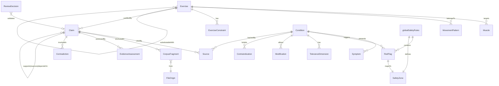

# Rapport d’architecture — Knowledge Base FitTrack

**Auteur :** Grok (xAI)  
**Date :** 23 août 2026  
**Version :** 0.1 — Phase de conception (pré-extracteur)  
**Corpus source :** les 4 fichiers fournis (Programmation hypertrophie, Anatomie/biomécanique, Base clinique adaptative, Schéma JSON)

---

## 1. Cartographie synthétique des quatre fichiers

| Fichier | Rôle principal | Structure / granularité | Types d’informations dominants | Champs / objets déjà structurés | Statut épistémique dominant |
|---|---|---|---|---|---|
| **Programmation hypertrophie — État des connaissances.md** | Corpus de programmation (volume, fréquence, charge, RIR, ROM, périodisation, populations, contradictions) | Sections numérotées 0–23 + tableaux de claims + registre de publications | Claims atomiques avec confiance, population, sources, contradictions, « ce qu’on ne peut PAS conclure », règles fortes / conditionnelles / zones d’incertitude | Tableaux d’affirmations (volume, fréquence, intensité, RIR…), registre DOI/PMID/URL, schémas décisionnels | Preuves directes (méta-analyses, position stands ACSM/IUSCA 2026), niveau de confiance explicite (Élevé → Très faible), expert_practice séparé |
| **Anatomie, biomécanique et sélection d’exercices (hypertrophie).md** | Corpus biomécanique + sélection / substitution d’exercices | Sections 0–12 + tableaux de critères de substitution + schéma de fiche exercice | Anatomie fonctionnelle par muscle, moment arms, longueur musculaire, profils de résistance, EMG vs hypertrophie, substitutions (quasi-directe / acceptable / partielle), contraintes articulaires | Tableau de critères de substitution, proposition de schéma de fiche exercice (exerciseId, movementPattern, primaryMuscles, lengthenedBias, substitutionGroups…), règles de prudence d’encodage | Biomécanique / imagerie (modéré à élevé), EMG (faible, jamais hypertrophie), expert_practice explicitement étiqueté, preuves directes d’hypertrophie régionale (ex. Nunes 2022 triceps) |
| **Base de connaissances — coaching musculation adaptatif.md** | Corpus clinique non diagnostique (symptômes, red flags, zones, adaptations) | Sections 1–17 + tableaux régionaux + matrice de conditions + registre de sources | Red flags, zones GREEN/ORANGE/RED, hiérarchie de modification, tolérance à la charge/amplitude, tendinopathies, rachis, genou, épaule, mythes, règles de formulation conversationnelle | Matrice condition × champs (certitude nécessaire, red flags, potentiellement aggravant, rôle résistance…), niveaux A–D + expert_practice, registre CPG/APTA/ACR/IFOMPT | CPG et consensus (A/B), biomécanique seule (D), expert_practice strictement séparé, interdiction de diagnostic |
| **Schéma de données IA coaching.json** | Schéma JSON Schema existant (draft 2020-12) pour conditions cliniques | Objet racine + $defs (source, evidenceRating, redFlag, zoneRule, toleranceDimension, modification, conditionRecord) | Structure de données prête à valider : conditionRecords, globalSafetyRules (redFlags + zoneLogic), evidenceRating, contraindications, recommendedModifications | Champs obligatoires (condition, symptoms, questionsToAsk, redFlags, movementSensitivity, loadSensitivity, evidenceLevel, sources, uncertainty…), enums stricts (action, urgency, status, scope…) | Schéma de validation uniquement ; contenu métier absent (aucune instance de conditionRecord) |

**Granularité globale** : les trois Markdown sont déjà très proches d’une base de claims atomiques (tableaux + listes + « ne pas conclure »). Le JSON est un schéma de validation clinique, pas encore peuplé.

---

## 2. Chevauchements, conflits et lacunes observés

### Chevauchements (complémentaires)
- Niveaux de preuve / confiance : les trois Markdown utilisent des grilles quasi identiques (Élevé/Modéré/Faible/Très faible + expert_practice).
- Sources : registre commun de publications (DOI, PMID, URL, type de document).
- Séparation stricte EMG ≠ hypertrophie (Anatomie + Programmation).
- Règles de prudence d’encodage (ne pas inventer, ne pas aplatir les nuances, expert_practice non confondu avec fait).
- Zones de sécurité et red flags (Base clinique + schéma JSON).

### Conflits / divergences de vocabulaire
- « Zone » : Base clinique utilise GREEN/ORANGE/RED ; schéma JSON utilise green/orange/red + zoneLogic.
- EvidenceRating : schéma JSON (level A_high…, confidence, directness) vs grilles Markdown (Élevé… + type de preuve).
- Condition vs Symptom pattern : schéma exige diagnosticCertaintyRequired ; Base clinique insiste sur « symptôme suffit en zone verte ».
- Substitution d’exercices : Anatomie définit trois niveaux d’équivalence ; aucun équivalent dans le schéma JSON.
- Volume / séries : Programmation parle de séries fractionnelles (0,5) ; aucun lien encore avec le domaine clinique.

### Lacunes structurelles
- Aucune entité Exercise / Muscle / MovementPattern dans le schéma JSON.
- Aucune entité Claim atomique ni Contradiction dans aucun des quatre fichiers (seulement des tableaux).
- Aucune versioning, aucun identifiant stable cross-fichier, aucune relation explicite Claim ↔ Source ↔ Fragment.
- Schéma JSON non peuplé (0 conditionRecord).
- Pas de mapping explicite entre les tableaux de Programmation/Anatomie et le schéma clinique.
- Champs de provenance (fichier + ancre Markdown) absents.
- Pas de distinction formelle EVIDENCE / EXPERT_PRACTICE / HYPOTHESIS au niveau schéma.

---

## 3. Architecture recommandée de la Knowledge Base

**Source de vérité unique** : un répertoire Git versionné de fichiers JSON/JSONL canoniques + JSON Schema de validation.  
Les projections (wiki, index vectoriel, règles exécutables, seeds futurs) sont **dérivées** et jamais sources concurrentes.

```
kb/
├── schemas/                 # JSON Schema (draft 2020-12)
│   ├── claim.schema.json
│   ├── source.schema.json
│   ├── exercise.schema.json
│   ├── clinical.schema.json
│   └── kb-root.schema.json
├── entities/                # instances normalisées (JSONL ou JSON)
│   ├── claims/
│   ├── sources/
│   ├── exercises/
│   ├── muscles/
│   ├── conditions/
│   ├── red-flags/
│   └── ...
├── relations/               # liens explicites (JSONL)
├── provenance/              # fragments + ancrages fichiers
├── reviews/                 # décisions humaines
└── versions/                # snapshots datés + changelog
```

**Principes**
- Identifiants stables (ULID ou slug + hash de contenu).
- Vocabulaires contrôlés (enums) centralisés.
- Séparation stricte :
  - **normatif** (règles de sécurité, red flags)
  - **observation du corpus** (claims extraits)
  - **projection** (wiki, index).
- Versionnement sémantique de la KB (MAJOR.MINOR.PATCH) + date de revue.
- Aucune base vectorielle comme seule KB : le graphe relationnel + schéma restent primaires ; le vectoriel est index secondaire.

---

## 4. Catalogue des entités et relations

### Entités canoniques (minimum viable)

| Entité | Responsabilité | Champs clés | Relations entrantes / sortantes |
|---|---|---|---|
| **Claim** | Unité atomique de connaissance | id, statement, knowledgeType, epistemicStatus, confidence, population, intervention, outcome, conditions, exceptions, cannotConclude, evidenceHierarchy | → Source[], → CorpusFragment[], → Contradiction[], → Claim (supports/nuances/dependsOn) |
| **Source** | Publication ou document | id, title, authorsOrg, year, documentType, doi, pmid, url, population, isOld, notes | ← Claim, ← EvidenceAssessment |
| **EvidenceAssessment** | Évaluation d’un claim | level, confidence, directness, rationale, sourceIds | → Claim, → Source |
| **Contradiction / EvidenceConflict** | Désaccord explicite | id, claimA, claimB, probableCause (volume non égalisé, population…), resolutionStatus | → Claim × 2 |
| **Population** | Groupe étudié | id, description, trainingStatus, sex, ageRange | ← Claim, ← Source |
| **Outcome** | Mesure de résultat | id, type (hypertrophy_IRM, strength_1RM…), region | ← Claim |
| **TrainingVariable** | Variable de programmation | id, name (volume, frequency, RIR…), definition | ← Claim, ← PracticalRule |
| **PracticalRule / DecisionRule** | Règle opérationnelle | id, statement, knowledgeType, applicability, priority | → Claim[], → SafetyZone |
| **Exercise** | Exercice canonique | id, name, aliases, movementPattern, jointActions, primaryMuscles, secondaryMuscles, equipment, resistanceProfile, lengthenedBias, axialLoad, lumbarDemand, stabilityDemand, substitutionGroups, evidenceConfidence | → Muscle[], → MovementPattern, → ExerciseConstraint, → Claim[] |
| **ExerciseVariant** | Variante (haltères vs barre…) | id, parentExercise, differingDimensions | → Exercise |
| **MovementPattern** | Pattern (poussée horizontale…) | id, name | ← Exercise |
| **Muscle** (+ région) | Muscle / portion | id, name, region, biarticular | ← Exercise, ← Claim |
| **JointAction** | Action articulaire | id, joint, action | ← Exercise |
| **Equipment** | Matériel | id, name | ← Exercise |
| **ResistanceProfile** | Profil de charge | id, type (ascendant, cloche…) | ← Exercise |
| **ExerciseConstraint** | Contrainte articulaire | joint, constraintType (charge_mecanique / inconfort_rapporte / risque_demontre / risque_suppose), source | ← Exercise |
| **Condition** | Condition / pattern symptomatique | id, name, aliases, scope, diagnosticCertaintyRequired, symptoms, questionsToAsk, irritability, referralThreshold, uncertainty | → RedFlag[], → ToleranceDimension[], → Modification[], → Source[] |
| **Symptom** | Symptôme | id, description | ← Condition |
| **RedFlag** | Signal d’arrêt | id, question, action, urgency, sourceIds, warning | ← Condition, ← globalSafetyRules |
| **ToleranceDimension** | Tolérance (mouvement, charge, axial…) | status, basis, testedRange, symptomDuring, symptomAfter24h | ← Condition |
| **SafetyZone** | GREEN / ORANGE / RED | criteria, allowedActions, forbiddenActions, referralThreshold | ← globalSafetyRules, ← PracticalRule |
| **Adaptation / Modification** | Modification d’entraînement | trigger, action, doseChange, monitoring, stopCriteria, evidence | ← Condition |
| **Contraindication** | Action interdite (seulement si justifiée) | action, scope, reason, sourceIds | ← Condition |
| **CorpusFragment** | Ancrage textuel | file, path, startLine, endLine, textHash | ← Claim, ← Source |
| **ReviewDecision** | Validation humaine | decision, reviewer, date, rationale | ← Claim / Condition / Exercise |

### Relations principales
- Claim —supports→ Claim
- Claim —contradicts→ Claim (via EvidenceConflict)
- Claim —derivedFrom→ CorpusFragment
- Exercise —targets→ Muscle (with region + confidence)
- Exercise —substitutableWith→ Exercise (equivalenceLevel + differingDimensions)
- Condition —hasRedFlag→ RedFlag
- Condition —hasTolerance→ ToleranceDimension
- RedFlag —overrides→ any Adaptation

---

## 5. Diagramme conceptuel (Mermaid)



---

## 6. Schémas proposés (extraits minimaux fondés uniquement sur le corpus)

### Claim (exemple tiré de Programmation §2)
```json
{
  "id": "claim-vol-dose-response-2026",
  "statement": "Plus de séries hebdomadaires produisent en moyenne plus d’hypertrophie, avec rendements décroissants.",
  "knowledgeType": "EVIDENCE",
  "epistemicStatus": "established_direction",
  "confidence": "high_for_direction_moderate_for_curve",
  "population": "adultes_sains_surtout_jeunes_hommes",
  "intervention": "volume_hebdomadaire_series",
  "outcome": "hypertrophy",
  "conditions": ["volume_egalise_ou_compare"],
  "exceptions": [],
  "cannotConclude": ["pas de meilleur nombre universel", "pas de preuve que toujours plus est mieux"],
  "evidenceHierarchy": ["meta_regression", "position_stand"],
  "sourceIds": ["src-pelland-2026", "src-schoenfeld-2017", "src-acsm-2026"],
  "corpusFragments": ["prog-hypertrophie.md#section-2-volume"],
  "validationStatus": "pending_human_review"
}
```

### Source (exemple)
```json
{
  "id": "src-pelland-2026",
  "title": "The Resistance Training Dose Response…",
  "authorsOrg": "Pelland JC et al.",
  "year": 2026,
  "documentType": "systematic_review_meta_regression",
  "doi": "10.1007/s40279-025-02344-w",
  "pmid": "41343037",
  "url": "https://pubmed.ncbi.nlm.nih.gov/41343037/",
  "population": "adultes sains",
  "isOld": false,
  "notes": "Méta-régression principale volume-hypertrophie"
}
```

### Exercise (exemple minimal tiré d’Anatomie §1.6 + §8)
```json
{
  "id": "ex-overhead-triceps-extension",
  "name": "Extension triceps overhead",
  "aliases": ["overhead extension", "skull crusher incliné bras verticaux"],
  "movementPattern": "isolation_coude",
  "jointActions": ["extension_coude", "flexion_epaule"],
  "primaryMuscles": [{"muscleId": "triceps", "region": "chef_long", "confidence": "moderate_to_high", "basis": "direct_hypertrophy_trial"}],
  "lengthenedBias": true,
  "resistanceProfile": "variable_selon_materiel",
  "axialLoad": false,
  "lumbarDemand": "low",
  "substitutionGroups": [{
    "exerciseId": "ex-triceps-pushdown",
    "equivalenceLevel": "partielle",
    "differingDimensions": ["longueur_musculaire_chef_long"]
  }],
  "evidenceConfidence": {
    "hypertrophy_chef_long": "moderate_to_high",
    "source": "Nunes et al. 2022"
  },
  "corpusFragments": ["anatomie-biomechanics.md#1.6"]
}
```

### Domaine clinique (migration du schéma existant)
- Conserver presque intégralement `$defs` (redFlag, zoneRule, toleranceDimension, modification, conditionRecord, evidenceRating, source).
- Ajouter `knowledgeType`, `corpusFragments`, `validationStatus`, `version`.
- Rendre `diagnosticCertaintyRequired` non bloquant pour les patterns purement symptomatiques (aligné Base clinique §6.2).
- Red flags restent prioritaires (règle non négociable).

---

## 7. Table de correspondance schéma JSON actuel → modèle unifié

| Élément schéma JSON actuel | Destination unifiée | Action |
|---|---|---|
| `schemaVersion` / `lastEvidenceReview` | `kb.version` + `ReviewDecision` | Conserver + étendre |
| `globalSafetyRules.redFlags` | Entité `RedFlag` + relation | Migrer tel quel |
| `globalSafetyRules.zoneLogic` | Entité `SafetyZone` | Migrer (green→GREEN etc.) |
| `conditionRecord` | Entité `Condition` | Migrer + ajouter `corpusFragments` |
| `evidenceRating` | Entité `EvidenceAssessment` | Migrer + lier à Claim |
| `source` | Entité `Source` | Migrer (déjà quasi identique) |
| `toleranceDimension` | Entité `ToleranceDimension` | Migrer |
| `modification` | Entité `Modification` | Migrer |
| `contraindications` | Entité `Contraindication` | Migrer (scope strict) |
| (absent) | `Claim`, `Exercise`, `Muscle`, `Contradiction`… | Nouveaux |
| (absent) | `CorpusFragment` | Nouveau (provenance) |

---

## 8. Pipeline d’extraction et de validation

```
1. Ingestion          → copie immuable des 4 fichiers + hash
2. Découpage structurel → sections, tableaux, listes (déterministe, regex + AST Markdown)
3. Extraction candidats → LLM assisté pour claims / exercices / conditions (prompt strict « ne pas inventer »)
4. Normalisation        → mapping vers vocabulaires contrôlés + enums
5. Résolution sources   → matching DOI/PMID/titre (déterministe + fuzzy contrôlé)
6. Déduplication        → hash de statement + sourceIds
7. Création relations   → supports / contradicts / targets (règles + LLM assisté)
8. Détection contradictions → comparaison explicite des tableaux « contradictions » du corpus
9. Validation schéma    → JSON Schema strict
10. Contrôles traçabilité → chaque Claim/Condition/Exercise a ≥1 CorpusFragment
11. Revue humaine ciblée → uniquement claims confiance « élevé » ou red flags / contradictions
12. Publication versionnée → tag Git + changelog
```

Chaque étape produit un artefact intermédiaire versionné (auditabilité). Extraction idempotente : même entrée → mêmes IDs stables.

---

## 9. Contrôles de qualité et critères d’acceptation

- 100 % des Claims ont au moins un `corpusFragment` valide.
- Aucun Claim `EVIDENCE` sans `sourceIds` non vides.
- Aucun `EXPERT_PRACTICE` ou `HYPOTHESIS` présenté comme `established`.
- Red flags toujours prioritaires (test unitaire).
- Aucun champ `primaryMuscles` rempli par défaut depuis le nom populaire.
- Différence EMG jamais stockée dans un champ d’hypertrophie.
- Schéma JSON Schema valide à 100 %.
- Revue humaine obligatoire pour tout RedFlag et toute Contradiction.
- Couverture : ≥ 95 % des tableaux de claims des trois Markdown extraits.

---

## 10. Décisions encore ouvertes (avec recommandation)

| Décision | Options | Recommandation | Compromis |
|---|---|---|---|
| Format instances | JSON vs JSONL | JSONL par type d’entité | Lecture ligne à ligne + Git-friendly |
| Identifiants | ULID vs slug sémantique | slug + hash court (ex. `claim-vol-dose-response-2026`) | Lisibilité humaine + stabilité |
| Stockage relations | Fichier relations séparé vs embeds | Fichier relations JSONL | Évite la duplication, facilite les requêtes |
| LLM dans extraction | Full LLM vs hybrid | Hybrid (déterministe d’abord, LLM pour candidats ambigus) | Coût + contrôle |
| Granularité Claim | 1 claim = 1 ligne de tableau vs fusion | 1 claim = 1 ligne de tableau du corpus | Fidélité maximale |
| Migration schéma clinique | Réécrire vs étendre | Étendre le schéma existant | Préserve le travail déjà fait |
| Langue | FR uniquement vs bilingue | FR (corpus) + champs `aliases` EN | Aligné sources |

---

## 11. Plan d’implémentation par étapes (sans écrire l’extracteur)

1. Finaliser et geler les JSON Schema (Claim, Source, Exercise, Clinical, Root).
2. Créer le squelette de répertoires + conventions d’ID.
3. Écrire les vocabulaires contrôlés (enums) extraits du corpus.
4. Extraire manuellement 5–10 Claims, 3 Exercises, 2 Conditions comme golden set.
5. Implémenter le pipeline déterministe (ingestion → découpage → validation).
6. Ajouter la couche LLM assistée (prompts verrouillés).
7. Tests de non-régression + contrôles de traçabilité.
8. Revue humaine du golden set.
9. Première publication versionnée v0.1.0.
10. Itération sur le reste du corpus.

---

## Contrat de sortie de la phase suivante

Pour pouvoir implémenter l’extracteur, les fichiers suivants doivent être produits et validés :

1. `schemas/claim.schema.json`
2. `schemas/source.schema.json`
3. `schemas/exercise.schema.json`
4. `schemas/clinical.schema.json` (migration du schéma existant)
5. `schemas/kb-root.schema.json`
6. `vocabularies/enums.json` (tous les enums contrôlés)
7. `golden-set/` (10 Claims + 5 Exercises + 3 Conditions + relations, validés manuellement)
8. `mapping/clinical-schema-migration.md` (table de correspondance détaillée)
9. `pipeline/specification.md` (spécification exacte de chaque étape + artefacts)
10. `quality/acceptance-criteria.md` (tests automatiques + checklist revue humaine)

Une fois ces 10 artefacts livrés et acceptés, l’implémentation de l’extracteur pourra commencer.

---

**Fin du rapport de conception.**  
Tous les éléments sont strictement dérivés des 4 fichiers source fournis. Aucune connaissance externe n’a été injectée.
